# Documento Modelo 1

## Gráficos e Diagramas com Markdown e Mermaid

Exemplos de gráficos e diagramas do dia a dia da engenharia/arquitetura de sistemas, analise de negócio, Gestão de Projetos e SCRUM.

---

## 1. Lorem Ipsum ...


# Título 1


## Título 2


### Título 3

dfssfd **texto** dsfsfd *texto* sadffdsa


fslkjsgggggggggggg`html` sgfdsfdghlksdfg


- Item
- fdsfa
  * fgsldkjg
  * fkdsçg
- rwetwre

1. treoiwuter
2. jalkjfalkds
  a. afdssslfkjjjjj
  b. fdaslkj
3. adjfl

##?##

| Coluna A | Coluna B |
|---|---|
| Valor 1 | Valor 2 |


|                |ASCII                          |HTML                         |
|----------------|-------------------------------|-----------------------------|
|Single backticks|`'Isn't this fun?'`            |'Isn't this fun?'            |
|Quotes          |`"Isn't this fun?"`            |"Isn't this fun?"            |
|Dashes          |`-- is en-dash, --- is em-dash`|-- is en-dash, --- is em-dash|


fdasfaa **adsfasdfa** dasfadsf
gfdjbkgbsdf *fsdjkgkfldbglsd* fkdsjglbsdbfgjk
gfdsiogfi ~~ofsdjgoidjsijgo~~ oidsfjgoidigjdsifgujo


##?##

 - [ ] safadf 
 - [ ] afsdsfd
 - [ ] safadsf
 - [ ] asdfasdf
 - [ ] asdff


```js
const exemplo = true;
```


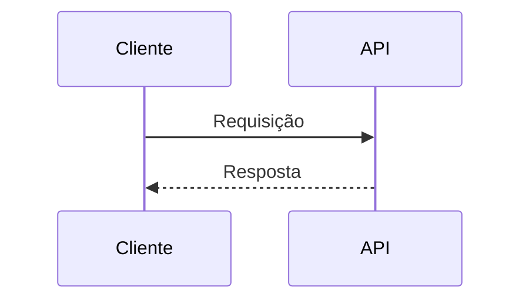


---

rweqerw
ewqrqwerqw
wqer


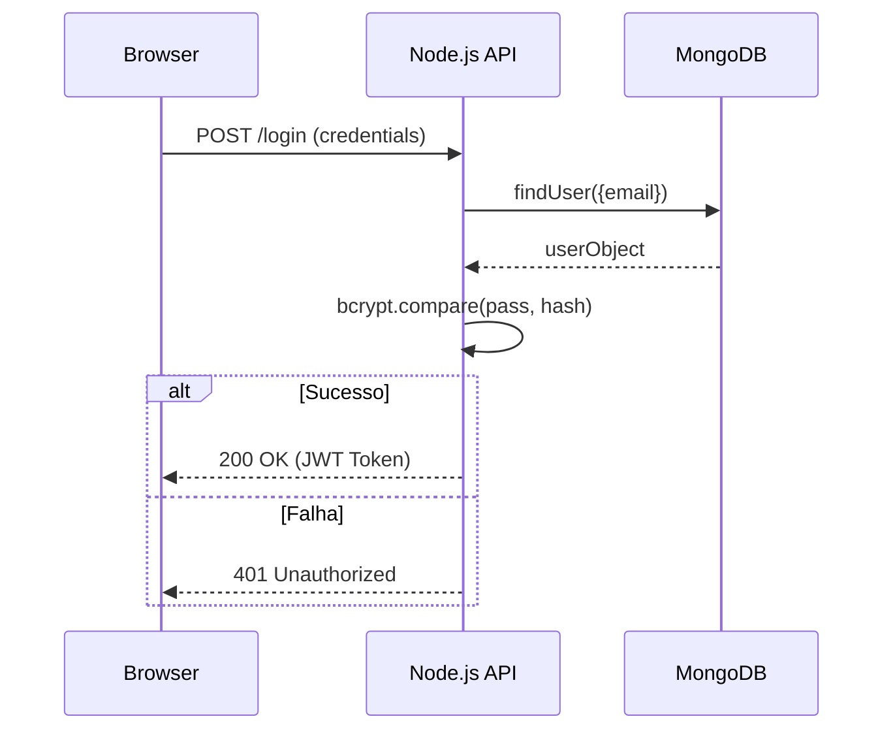


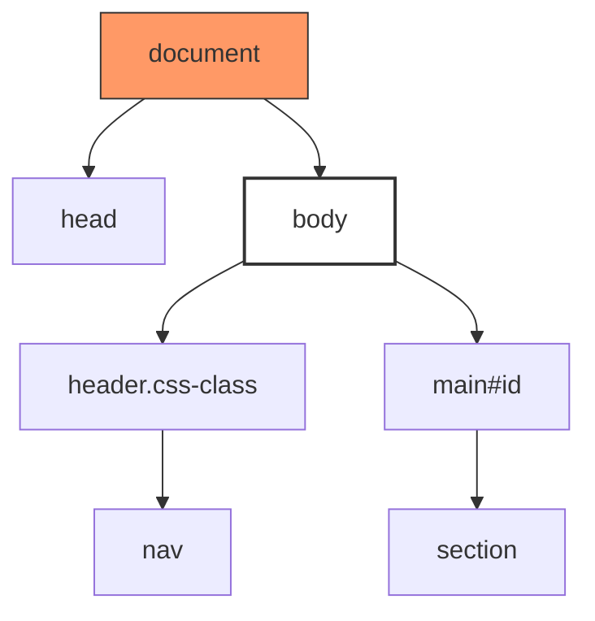


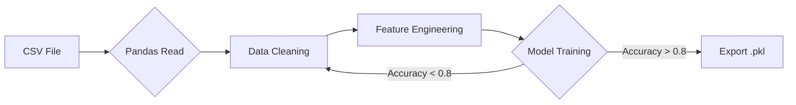


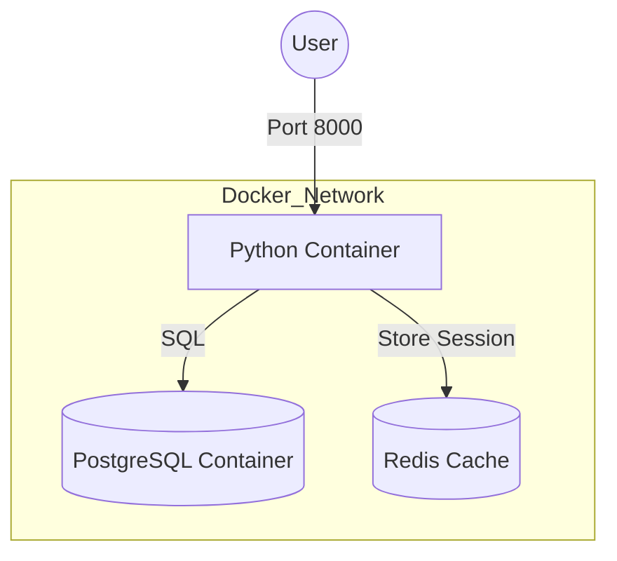

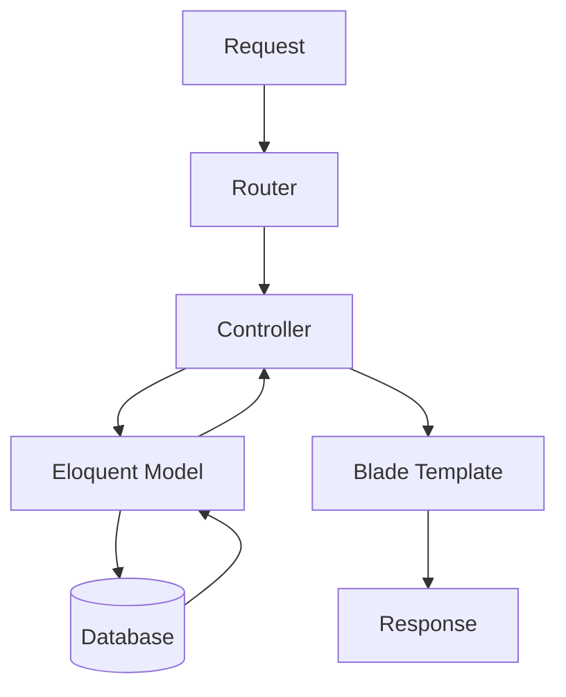


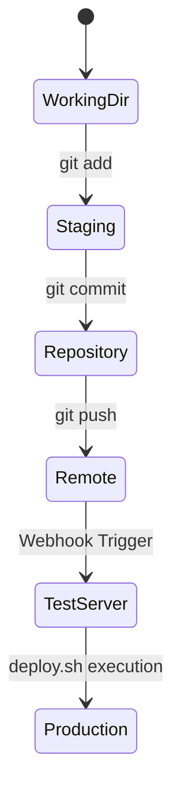


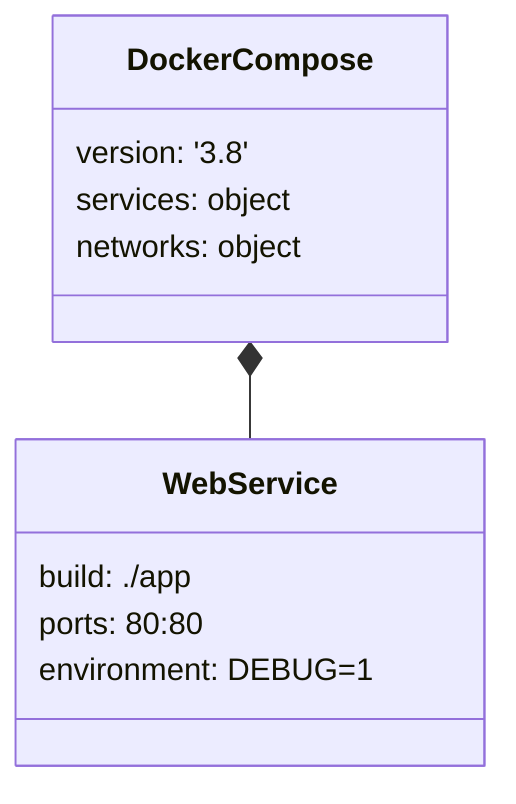


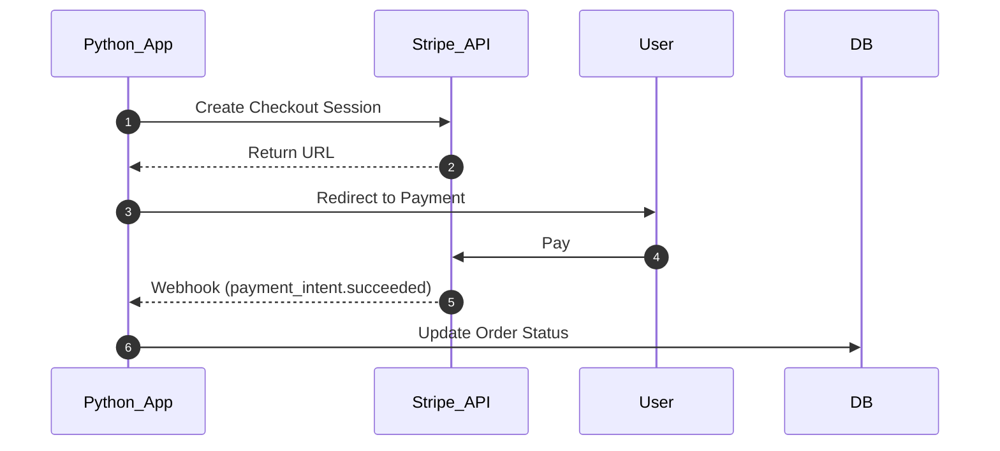


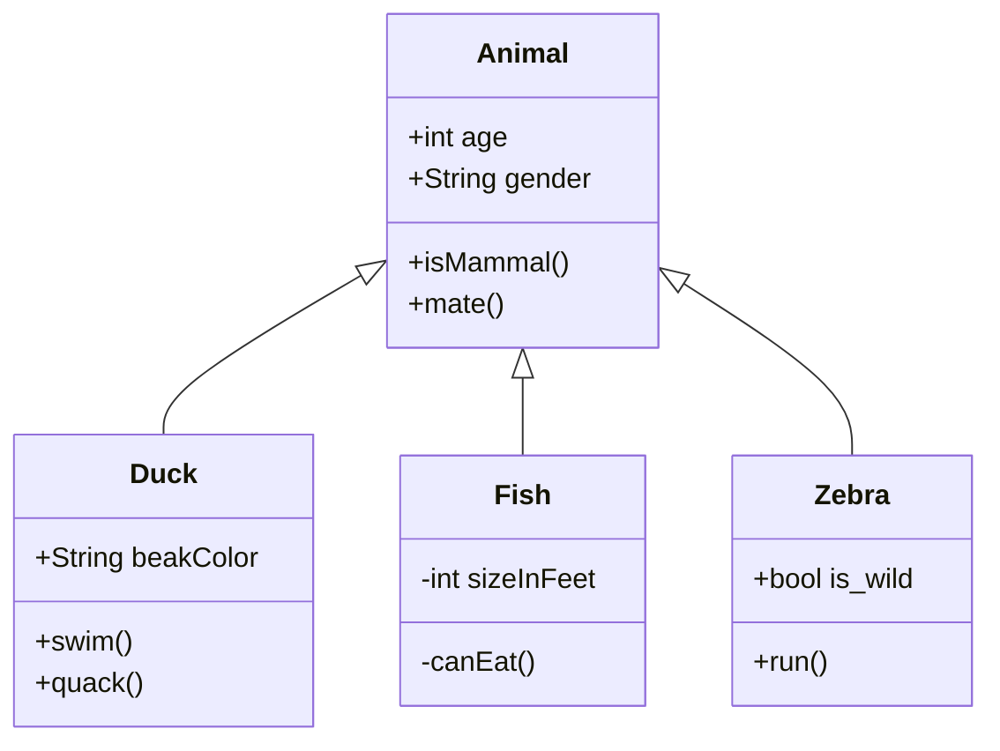


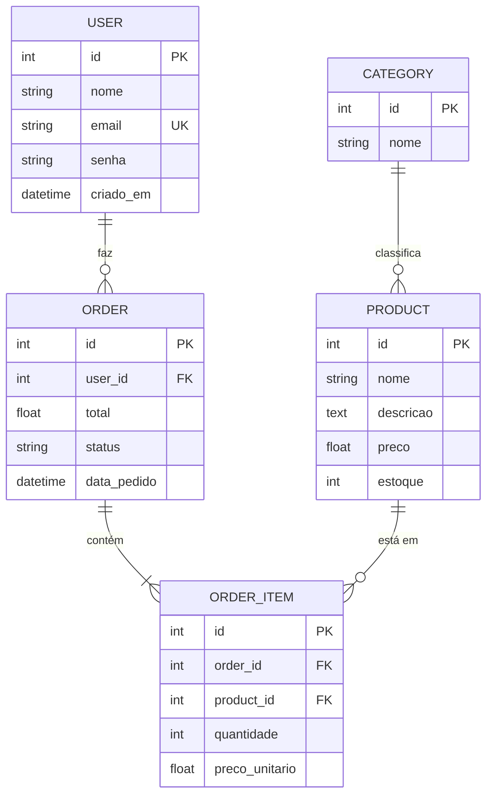


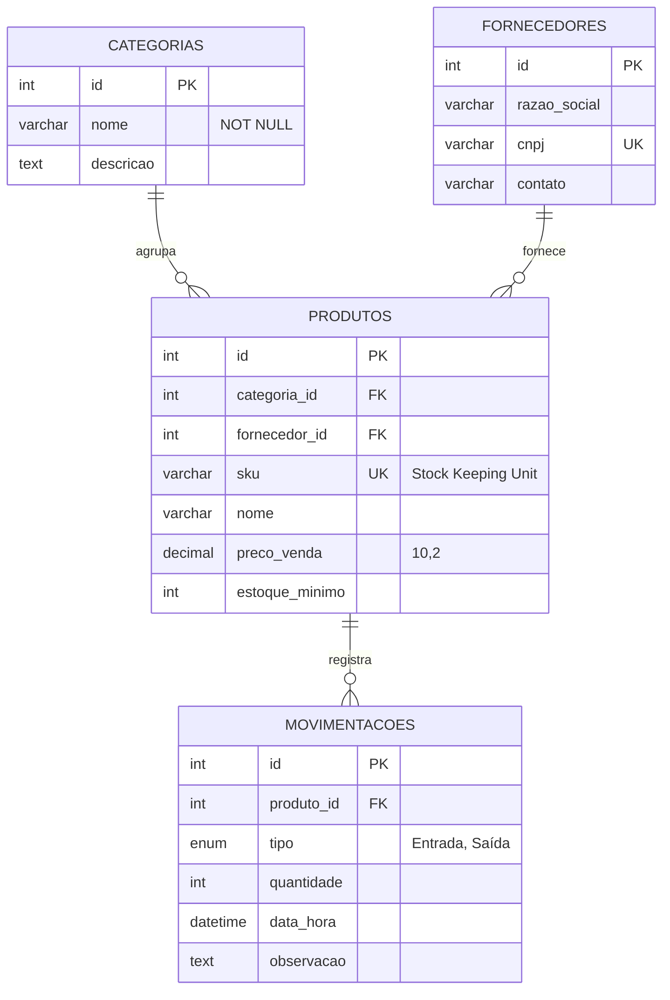


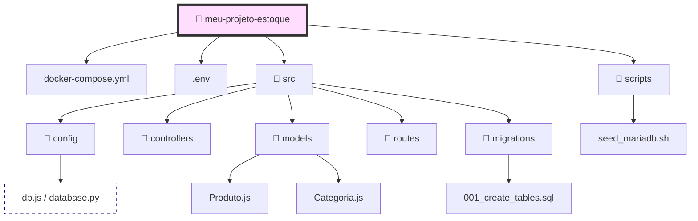


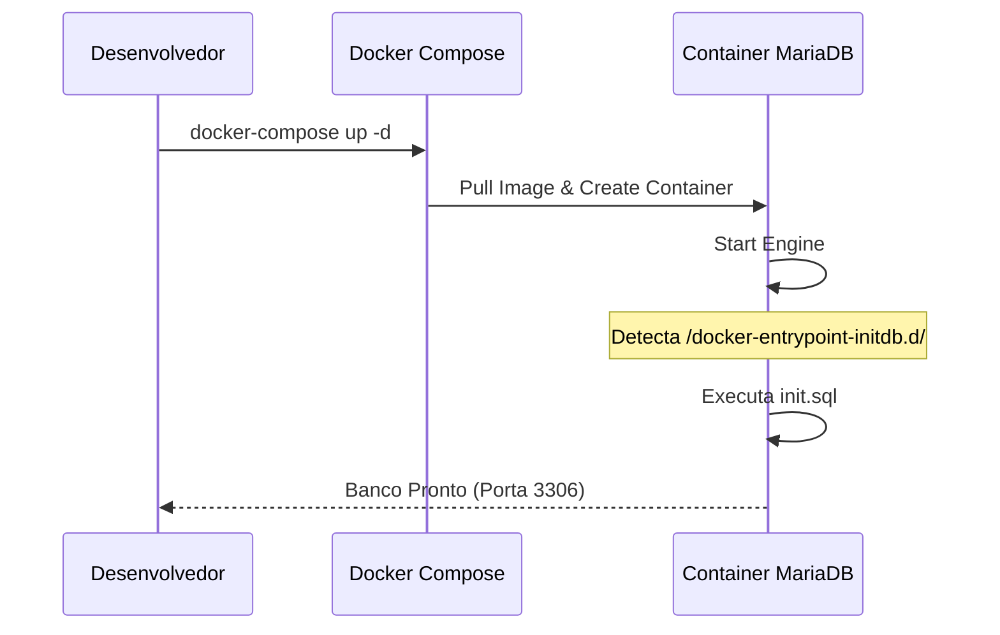


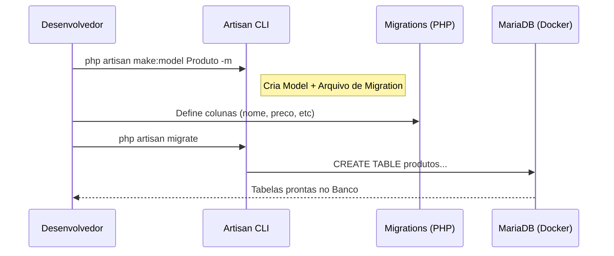


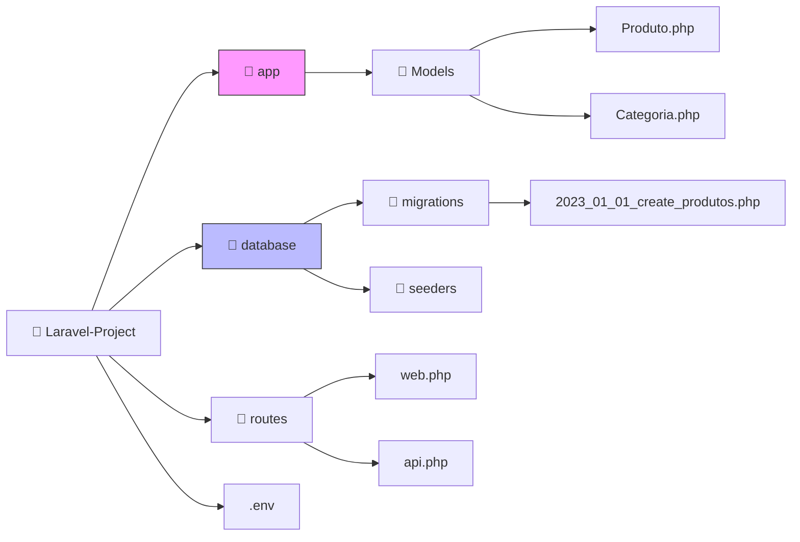


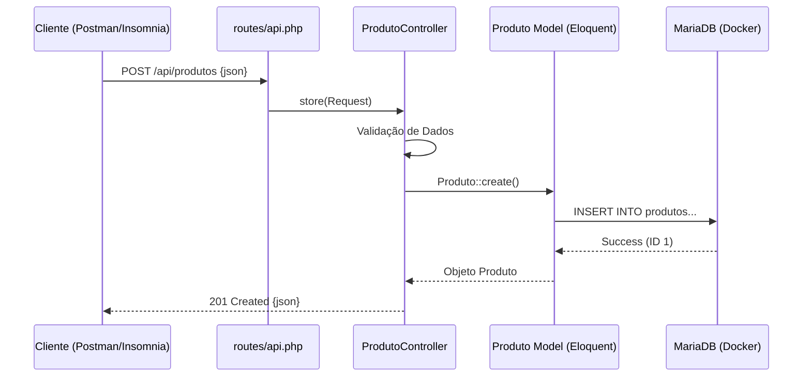


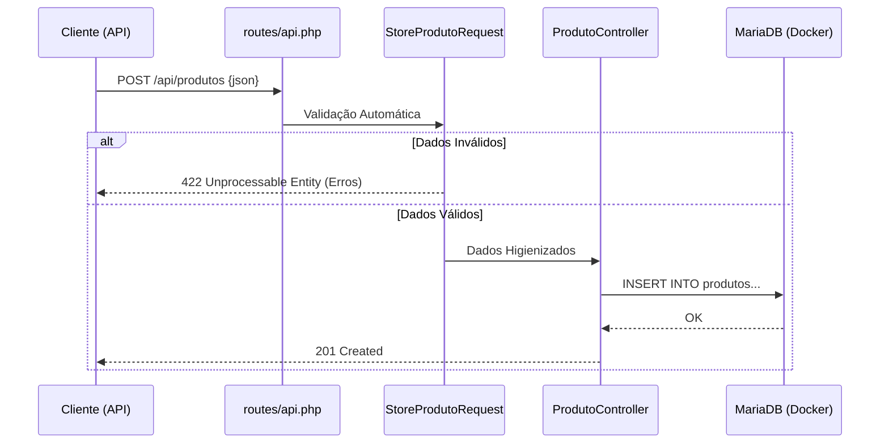


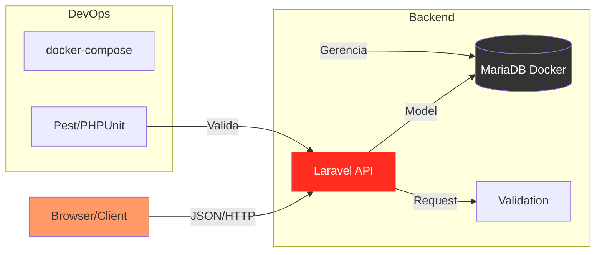


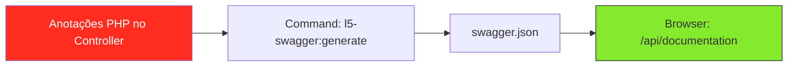


```mermaid
sequenceDiagram
    participant Dev as Dev (Local)
    participant Git as GitHub/GitLab
    participant Action as CI/CD Pipeline
    participant Prod as Servidor Produção

    Dev->>Git: git push origin main
    Git->>Action: Trigger Pipeline
    Action->>Action: Instala dependências (Composer/NPM)
    Action->>Action: Roda Testes (PHPUnit)
    
    alt Testes Passaram
        Action->>Prod: SSH: git pull & artisan migrate
        Prod-->>Dev: Deploy Sucesso! 🚀
    else Testes Falharam
        Action-->>Dev: Notificação de Erro ❌
    end
```


```mermaid
graph TD
    Root[📁 projeto-final]
    
    Root --> App[📁 app/Http]
    App --> Requests[📁 Requests]
    App --> Controllers[📁 Controllers]
    
    Root --> Tests[📁 tests/Feature]
    
    Root --> Docker[📁 docker]
    Docker --> Nginx[nginx.conf]
    
    Root --> Github[📁 .github/workflows]
    Github --> Deploy[deploy.yml]
    
    Root --> Public[📁 public]
    Public --> Doc[📁 api/documentation]
    
    style Github fill:#24292e,color:#fff
    style Docker fill:#2496ed,color:#fff
```


```mermaid
sequenceDiagram
    participant User as Usuário/Frontend
    participant Sanctum as Middleware Sanctum
    participant DB as MariaDB

    User->>Sanctum: POST /api/login (credentials)
    Sanctum->>DB: Verifica e-mail e senha
    DB-->>Sanctum: OK
    Sanctum-->>User: Retorna plainTextToken
    
    Note over User, Sanctum: Próximas requisições com Header "Authorization: Bearer {token}"
    
    User->>Sanctum: GET /api/produtos
    Sanctum->>Sanctum: Valida Token
    Sanctum-->>User: Lista de Produtos
```


```mermaid
graph TD
    A[Docker Compose] --> B[PHP-FPM]
    A --> C[MariaDB]
    A --> D[Nginx]
    B --> E[Migrations/Seeders]
    B --> F[API Endpoints]
```


```mermaid
mindmap
  root((Projeto Laravel))
    Infraestrutura
      Docker Compose
      MariaDB
      Nginx
    Backend
      Models & Migrations
      Controllers & Requests
      Sanctum Auth
    Qualidade
      PHPUnit Tests
      Swagger Docs
    Frontend
      Fetch API
      Tailwind CSS
```


```mermaid
sequenceDiagram
    participant User as Navegador (Input Pesquisa)
    participant LW as Livewire Component (PHP)
    participant DB as MariaDB

    User->>LW: Digita "Teclado" (Ajax)
    LW->>DB: SELECT * FROM produtos WHERE nome LIKE %Teclado%
    DB-->>LW: Resultados
    LW-->>User: Atualiza apenas a Tabela (DOM Diffing)
```


```mermaid
graph LR
    Root[📁 projeto-laravel]
    Root --> App[📁 app]
    App --> LW_Comp[📁 Livewire]
    LW_Comp --> Dash[StockDashboard.php]
    
    Root --> Resources[📁 resources]
    Resources --> Views[📁 views]
    Views --> LW_View[📁 livewire]
    LW_View --> DashView[stock-dashboard.blade.php]
    
    style LW_Comp fill:#fb70a9,color:#fff
    style LW_View fill:#fb70a9,color:#fff
```


```mermaid
flowchart TD
    subgraph SO ["🐧 Servidor Linux (Bash CLI)"]
        direction TB
        WEB[Servidores Web: Apache / Nginx]
        
        subgraph Backend ["🐘 Backend (PHP 8.x)"]
            LV[Laravel Framework]
            API[Eloquent & API Routes]
        end

        subgraph Frontend ["🟢 Frontend (Vue.js 3)"]
            VUE[Vue Components]
            EP[Element Plus UI]
            AX[Axios HTTP Client]
        end
    end

    %% Fluxo de Dados
    Usuário -- HTTP/S --> WEB
    WEB -- Proxy --> LV
    AX -- Request JSON --> API
    API -- Response JSON --> AX
    VUE -- Renderiza --> EP
```


```mermaid
classDiagram
    class UserController {
        -UserRepository userRepo
        +index(Request request) Response
        +store(UserRequest data) JSON
        -validateUser(data) bool
    }

    class User {
        +int id
        +string name
        +string email
        -string password
        +save() bool
        +delete() void
    }

    UserController --> User : manipula
```


```mermaid
---
title: Estrutura do Código HTML
---
graph TD
    A[Documento HTML] --> B[Cabeçalho - head]
    A --> C[Corpo - body]
```


```mermaid
%% Este diagrama explica a estrutura de um código escrito em HTML
graph LR
    HTML --> Head
    HTML --> Body
```


```mermaid
flowchart TB
    Header([Explicação: Código em sintaxe HTML])
    Header -.-> RealCode
    subgraph RealCode [Estrutura]
        direction LR
        tag1[div] --> tag2[p]
    end
    
    style Header fill:#f9f,stroke:#333,stroke-width:2px
```


```mermaid
---
title: Estrutura Fundamental de um Código HTML
---
graph TD
    %% Nós principais
    Raiz[html - Tag Raiz]
    
    %% Cabeçalho
    Head[head - Informações do Documento]
    Meta[meta - Metadados e Charset]
    Title[title - Título da Aba]
    
    %% Corpo
    Body[body - Conteúdo Visível]
    H1[h1 - Título Principal]
    P[p - Parágrafo de Texto]
    Div[div - Container de Bloco]

    %% Conexões
    Raiz --> Head
    Raiz --> Body
    
    Head --> Meta
    Head --> Title
    
    Body --> H1
    Body --> P
    Body --> Div

    %% Estilização para destacar que é HTML
    style Raiz fill:#f16529,stroke:#333,stroke-width:2px,color:#fff
    style Body fill:#ebebeb,stroke:#333,stroke-width:2px
```


```mermaid
---
title: Estrutura HTML com Atributos e Formulários
---
graph TD
    %% Estrutura Base
    HTML[html] --> BODY[body]

    %% Seção de Links e Mídia (Atributos)
    BODY --> NAV[nav - Navegação]
    NAV --> A["a (Atributo: href='url')"]
    
    BODY --> IMG["img (Atributo: src='imagem.jpg')"]

    %% Seção de Formulário
    BODY --> FORM["form (Atributo: action='/enviar')"]
    
    subgraph Campos [Elementos do Formulário]
        FORM --> LABEL[label - Rótulo]
        FORM --> INPUT["input (Atributo: type='text')"]
        FORM --> BTN[button - Enviar]
    end

    %% Estilização para Diferenciação
    style HTML fill:#f16529,stroke:#333,color:#fff
    style FORM fill:#e4f1fe,stroke:#22a7f0,stroke-width:2px
    style Campos fill:#f9f9f9,stroke-dasharray: 5 5
```


```text
projeto-laravel/
  ├── app/            # Lógica central (Models, Providers, Http)
  ├── bootstrap/      # Inicialização do framework
  ├── config/         # Arquivos de configuração
  ├── database/       # Migrations, seeders e factories
  ├── public/         # Ponto de entrada (index.php) e assets
  ├── resources/      # Views (Blade), CSS e JS brutos
  ├── routes/         # Definição de rotas (web.php, api.php)
  ├── storage/        # Logs, cache e arquivos compilados
  ├── tests/          # Testes automatizados
  └── vendor/         # Dependências do Composer
```


```mermaid
classDiagram
    class Route {
        +get(path, action)
        +post(path, action)
    }
    class Controller {
        +index()
        +store(Request)
    }
    class Model {
        +all()
        +find(id)
        +save()
    }
    class View {
        +render(data)
    }

    Route --> Controller : chama
    Controller --> Model : consulta dados
    Controller --> View : retorna resposta
```


```mermaid
sequenceDiagram
    participant U as Usuário
    participant R as Rotas (web.php)
    participant C as Controller
    participant M as Model (Eloquent)
    participant V as View (Blade)

    U->>R: Acessa URL /perfil/1
    R->>C: Chama PerfilController@show
    C->>M: User::find(1)
    M-->>C: Retorna Objeto Usuário
    C->>V: Envia dados para a View
    V-->>U: Renderiza HTML final
```


```mermaid
classDiagram
    class ServiceProvider {
        +register()
        +boot()
    }
    class Middleware {
        +handle(Request, next)
    }
    class Controller {
        +index(Request)
    }
    class Service {
        +executeBusinessLogic()
    }

    ServiceProvider --> Service : Registra no Container
    Middleware ..> Controller : Filtra Requisição
    Controller o-- Service : Recebe via Injeção
```


```mermaid
sequenceDiagram
    autonumber
    participant U as Usuário
    participant Kernel as HTTP Kernel / Providers
    participant M as Middleware (Auth/CSRF)
    participant R as Router
    participant C as Controller
    participant S as Service/Model
    
    U->>Kernel: Envia Requisição (Request)
    Note over Kernel: Service Providers carregam serviços
    Kernel->>M: Passa pelo Pipeline de Middlewares
    
    alt Falha na Validação
        M-->>U: 401 Unauthorized / 403 Forbidden
    else Sucesso
        M->>R: Encaminha para o Router
        R->>C: Invoca o Método do Controller
        C->>S: Solicita Lógica de Negócio/Dados
        S-->>C: Retorna Dados
        C-->>U: Retorna Resposta (HTML/JSON)
    end
```


```mermaid
sequenceDiagram
Alice ->> Bob: Hello Bob, how are you?
Bob-->>John: How about you John?
Bob--x Alice: I am good thanks!
Bob-x John: I am good thanks!
Note right of John: Bob thinks a long<br/>long time, so long<br/>that the text does<br/>not fit on a row.

Bob-->Alice: Checking with John...
Alice->John: Yes... John, how are you?
```


```mermaid
graph LR
A[Square Rect] -- Link text --> B((Circle))
A --> C(Round Rect)
B --> D{Rhombus}
C --> D
```


```mermaid
sequenceDiagram
Alice ->> Bob: Hello Bob, how are you?
Bob-->>John: How about you John?
Bob--x Alice: I am good thanks!
Bob-x John: I am good thanks!
Note right of John: Bob thinks a long<br/>long time, so long<br/>that the text does<br/>not fit on a row.

Bob-->Alice: Checking with John...
Alice->John: Yes... John, how are you?
```


```mermaid
graph LR
A[Square Rect] -- Link text --> B((Circle))
A --> C(Round Rect)
B --> D{Rhombus}
C --> D
```


```mermaid
sequenceDiagram
    participant U as Usuário
    participant API as API de Gateway
    participant Auth as Serviço de Autenticação
    participant DB as Banco de Dados

    U->>API: Solicita login (user/pass)
    API->>Auth: Valida credenciais
    Auth->>DB: Busca usuário
    DB-->>Auth: Retorna dados/hash
    Auth-->>API: Retorna Token JWT
    API-->>U: Sucesso + Token
```


```mermaid
graph TD
    User((Usuário)) --> CDN[Cloudfront/CDN]
    CDN --> LB{Load Balancer}
    LB --> WebA[App Server A]
    LB --> WebB[App Server B]
    WebA --> Redis[(Cache Redis)]
    WebB --> Redis
    WebA --> DB[(PostgreSQL)]
    WebB --> DB
```

```mermaid
erDiagram
    CLIENTE ||--o{ PEDIDO : "faz"
    PEDIDO ||--|{ ITEM : "contém"
    PRODUTO ||--o{ ITEM : "está em"

    CLIENTE {
        string nome
        string email
        string cpf
    }

    PEDIDO {
        int id
        date data_criacao
        float valor_total
    }

    PRODUTO {
        string sku
        string nome
        float preco
    }
```


```mermaid
gantt
    title Roadmap de Desenvolvimento
    dateFormat  YYYY-MM-DD
    section Descoberta
    Análise de Requisitos  :a1, 2023-10-01, 10d
    Design de UX/UI        :after a1, 7d
    section Desenvolvimento
    Setup do Backend       :2023-10-15, 12d
    Integração Frontend    :2023-10-20, 15d

```


```mermaid
graph LR
    A[Início: Cliente faz pedido] --> B{Crédito aprovado?}
    B -- Sim --> C[Separar no estoque]
    B -- Não --> D[Notificar cliente]
    C --> E{Tem estoque?}
    E -- Sim --> F[Emitir Nota Fiscal]
    E -- Não --> G[Solicitar compra ao fornecedor]
    F --> H[Envio Logística]
    G --> C
```


```mermaid
mindmap
  root((Scrum))
    Cerimônias
      Sprint Planning
      Daily Scrum
      Sprint Review
      Retrospectiva
    Artefatos
      Product Backlog
      Sprint Backlog
      Incremento
    Papéis
      Product Owner
      Scrum Master
      Developers
```


```mermaid
timeline
    title Roadmap de Produto 2024
    Q1 : MVP : Login : Cadastro de Produtos
    Q2 : Integração : Gateway de Pagamento : API dos Correios
    Q3 : Expansão : App Mobile : Relatórios Avançados
```


```mermaid
stateDiagram-v2
    [*] --> Pendente
    Pendente --> Pago: Confirmação de Pagamento
    Pendente --> Cancelado: Timeout
    Pago --> EmPreparacao
    EmPreparacao --> Enviado
    Enviado --> Entregue
    Enviado --> Extraviado
    Extraviado --> Reembolsado
    Entregue --> [*]
```


```mermaid
block-beta
  columns 3
  UI("Frontend Web")
  Mobile("App Mobile")
  Gateway(("API Gateway"))
  
  block:group1:3
    Auth("Serviço Auth")
    Order("Serviço Pedidos")
    Pay("Serviço Pagamentos")
  end
  
  DB1[("Redis")]
  DB2[("PostgreSQL")]
  DB3[("Stripe API")]

  UI --> Gateway
  Mobile --> Gateway
  Gateway --> Auth
  Gateway --> Order
  Auth --> DB1
  Order --> DB2
  Pay --> DB3
```


```mermaid
classDiagram
    class Usuario {
        +String email
        +String senha
        +fazerLogin()
    }
    class Pedido {
        +int id
        +Date data
        +calculaTotal()
    }
    Usuario "1" --> "*" Pedido : realiza
```


```mermaid
timeline
    title History of Social Media Platform
    2002 : LinkedIn
    2004 : Facebook
         : Google
    2005 : YouTube
    2006 : Twitter
```


```mermaid
pie title Pets adopted by volunteers
    "Dogs" : 386
    "Cats" : 85
    "Rats" : 15
```

```mermaid
quadrantChart
    title Reach and engagement of campaigns
    x-axis Low Reach --> High Reach
    y-axis Low Engagement --> High Engagement
    quadrant-1 We should expand
    quadrant-2 Need to promote
    quadrant-3 Re-evaluate
    quadrant-4 May be improved
    Campaign A: [0.3, 0.6]
    Campaign B: [0.45, 0.23]
    Campaign C: [0.57, 0.69]
    Campaign D: [0.78, 0.34]
    Campaign E: [0.40, 0.34]
    Campaign F: [0.35, 0.78]
```


```mermaid
    requirementDiagram

    requirement test_req {
    id: 1
    text: the test text.
    risk: high
    verifymethod: test
    }

    element test_entity {
    type: simulation
    }

    test_entity - satisfies -> test_req
```


```mermaid
---
title: Example Git diagram
---
gitGraph
   commit
   commit
   branch develop
   checkout develop
   commit
   commit
   checkout main
   merge develop
   commit
   commit
```


```mermaid
    C4Context
      title System Context diagram for Internet Banking System
      Enterprise_Boundary(b0, "BankBoundary0") {
        Person(customerA, "Banking Customer A", "A customer of the bank, with personal bank accounts.")
        Person(customerB, "Banking Customer B")
        Person_Ext(customerC, "Banking Customer C", "desc")

        Person(customerD, "Banking Customer D", "A customer of the bank, <br/> with personal bank accounts.")

        System(SystemAA, "Internet Banking System", "Allows customers to view information about their bank accounts, and make payments.")

        Enterprise_Boundary(b1, "BankBoundary") {

          SystemDb_Ext(SystemE, "Mainframe Banking System", "Stores all of the core banking information about customers, accounts, transactions, etc.")

          System_Boundary(b2, "BankBoundary2") {
            System(SystemA, "Banking System A")
            System(SystemB, "Banking System B", "A system of the bank, with personal bank accounts. next line.")
          }

          System_Ext(SystemC, "E-mail system", "The internal Microsoft Exchange e-mail system.")
          SystemDb(SystemD, "Banking System D Database", "A system of the bank, with personal bank accounts.")

          Boundary(b3, "BankBoundary3", "boundary") {
            SystemQueue(SystemF, "Banking System F Queue", "A system of the bank.")
            SystemQueue_Ext(SystemG, "Banking System G Queue", "A system of the bank, with personal bank accounts.")
          }
        }
      }

      BiRel(customerA, SystemAA, "Uses")
      BiRel(SystemAA, SystemE, "Uses")
      Rel(SystemAA, SystemC, "Sends e-mails", "SMTP")
      Rel(SystemC, customerA, "Sends e-mails to")

      UpdateElementStyle(customerA, $fontColor="red", $bgColor="grey", $borderColor="red")
      UpdateRelStyle(customerA, SystemAA, $textColor="blue", $lineColor="blue", $offsetX="5")
      UpdateRelStyle(SystemAA, SystemE, $textColor="blue", $lineColor="blue", $offsetY="-10")
      UpdateRelStyle(SystemAA, SystemC, $textColor="blue", $lineColor="blue", $offsetY="-40", $offsetX="-50")
      UpdateRelStyle(SystemC, customerA, $textColor="red", $lineColor="red", $offsetX="-50", $offsetY="20")

      UpdateLayoutConfig($c4ShapeInRow="3", $c4BoundaryInRow="1")
```


```mermaid
pie title NETFLIX
         "Time spent looking for movie" : 90
         "Time spent watching it" : 10

```


```mermaid
pie title What Voldemort doesn't have?
         "FRIENDS" : 2
         "FAMILY" : 3
         "NOSE" : 45
```


```mermaid
sequenceDiagram
    Alice ->> Bob: Hello Bob, how are you?
    Bob-->>John: How about you John?
    Bob--x Alice: I am good thanks!
    Bob-x John: I am good thanks!
    Note right of John: Bob thinks a long<br/>long time, so long<br/>that the text does<br/>not fit on a row.

    Bob-->Alice: Checking with John...
    Alice->John: Yes... John, how are you?
```


```mermaid
graph LR
    A[Square Rect] -- Link text --> B((Circle))
    A --> C(Round Rect)
    B --> D{Rhombus}
    C --> D
```

```mermaid
graph TB
    sq[Square shape] --> ci((Circle shape))

    subgraph A
        od>Odd shape]-- Two line<br/>edge comment --> ro
        di{Diamond with <br/> line break} -.-> ro(Rounded<br>square<br>shape)
        di==>ro2(Rounded square shape)
    end

    %% Notice that no text in shape are added here instead that is appended further down
    e --> od3>Really long text with linebreak<br>in an Odd shape]

    %% Comments after double percent signs
    e((Inner / circle<br>and some odd <br>special characters)) --> f(,.?!+-*ز)

    cyr[Cyrillic]-->cyr2((Circle shape Начало));

     classDef green fill:#9f6,stroke:#333,stroke-width:2px;
     classDef orange fill:#f96,stroke:#333,stroke-width:4px;
     class sq,e green
     class di orange
```


```mermaid
sequenceDiagram
    loop Daily query
        Alice->>Bob: Hello Bob, how are you?
        alt is sick
            Bob->>Alice: Not so good :(
        else is well
            Bob->>Alice: Feeling fresh like a daisy
        end

        opt Extra response
            Bob->>Alice: Thanks for asking
        end
    end
```


```mermaid
sequenceDiagram
    participant Alice
    participant Bob
    Alice->>John: Hello John, how are you?
    loop HealthCheck
        John->>John: Fight against hypochondria
    end
    Note right of John: Rational thoughts<br/>prevail...
    John-->>Alice: Great!
    John->>Bob: How about you?
    Bob-->>John: Jolly good!
```


```mermaid
sequenceDiagram
    participant web as Web Browser
    participant blog as Blog Service
    participant account as Account Service
    participant mail as Mail Service
    participant db as Storage

    Note over web,db: The user must be logged in to submit blog posts
    web->>+account: Logs in using credentials
    account->>db: Query stored accounts
    db->>account: Respond with query result

    alt Credentials not found
        account->>web: Invalid credentials
    else Credentials found
        account->>-web: Successfully logged in

        Note over web,db: When the user is authenticated, they can now submit new posts
        web->>+blog: Submit new post
        blog->>db: Store post data

        par Notifications
            blog--)mail: Send mail to blog subscribers
            blog--)db: Store in-site notifications
        and Response
            blog-->>-web: Successfully posted
        end
    end
```


```mermaid
graph TD
    A[Início: Solicitação de Compra] --> B{Valor > R$ 5.000?}
    B -- Sim --> C[Aprovação do Diretor]
    B -- Não --> D[Aprovação do Gerente]
    C --> E{Aprovado?}
    D --> E
    E -- Sim --> F[Processar Pagamento]
    E -- Não --> G[Notificar Solicitante]
    F --> H[Fim]
    G --> A
    
    style A fill:#f9f,stroke:#333,stroke-width:2px
    style F fill:#ccf,stroke:#f66,stroke-width:2px
```

```mermaid
sequenceDiagram
    participant U as Usuário
    participant F as Frontend
    participant B as Backend API
    participant P as Provedor (Google)
    
    U->>F: Clica em "Login com Google"
    F->>P: Redireciona com ClientID
    P-->>U: Solicita Credenciais
    U->>P: Insere Credenciais
    P-->>F: Retorna Authorization Code
    F->>B: Envia Code
    B->>P: Troca Code por Token
    P-->>B: Retorna JWT Token
    B-->>F: Cria Sessão
    F-->>U: Usuário Logado
```


```mermaid
gantt
    title Planejamento de Lançamento - V2.0
    dateFormat  YYYY-MM-DD
    section Planejamento
    Definição de Requisitos :a1, 2026-04-15, 10d
    section Desenvolvimento
    Frontend            :after a1, 15d
    Backend             :after a1, 20d
    section QA
    Testes Funcionais   :2026-05-10, 10d
    section Deploy
    Produção            :5d
```


```mermaid
journey
    title Jornada de Compra do Cliente
    section Pesquisa
      Busca produto: 3: Usuário
      Compara preços: 2: Usuário
    section Compra
      Adiciona ao carrinho: 5: Usuário, Sistema
      Pagamento: 4: Usuário, Sistema, Banco
    section Pós-venda
      Recebe e-mail: 5: Sistema
      Recebe produto: 3: Correios
```


```mermaid
erDiagram
    CLIENTE ||--o{ PEDIDO : faz
    PEDIDO ||--|{ ITEM-PEDIDO : contem
    PRODUTO ||--o{ ITEM-PEDIDO : inclui
    
    CLIENTE {
        string nome
        string email
    }
    PEDIDO {
        int id
        date data
    }
    PRODUTO {
        string nome
        float preco
    }
```


```mermaid
mindmap
  root((Campanha Q3))
    Redes Sociais
      Instagram
      LinkedIn
    Conteúdo
      Blogpost
      Video
    Anúncios
      Google Ads
      Meta Ads
```


```mermaid
stateDiagram-v2
    [*] --> Aberto
    Aberto --> EmProgresso : Iniciar
    EmProgresso --> Bloqueado : Impedimento
    Bloqueado --> EmProgresso : Resolvido
    EmProgresso --> EmTeste : Finalizar
    EmTeste --> Aberto : Reprovado
    EmTeste --> Finalizado : Aceito
    Finalizado --> [*]
```


```mermaid
graph TD
    subgraph Mobile_Screen [Tela de Login - iPhone 13]
        direction TB
        Logo((LOGO)) 
        
        Input1[/Campo: E-mail ou CPF/]
        Input2[/Campo: Senha/]
        
        BtnLogin[[Botão: Entrar]]
        Link1(Esqueci minha senha)
        
        Separator["--- ou entre com ---"]
        
        BtnGoogle[Google Login]
        BtnApple[Apple ID]
        
        Register(Não tem conta? Cadastre-se)
    end

    style Mobile_Screen fill:#f9f9f9,stroke:#333,stroke-width:2px
    style BtnLogin fill:#007bff,color:#fff
```


```mermaid
stateDiagram-v2
    [*] --> Sacola: Clicar em Comprar
    Sacola --> Identificacao: Finalizar Compra
    
    Identificacao --> Endereco: Usuário Logado
    Identificacao --> Cadastro: Novo Usuário
    Cadastro --> Endereco
    
    Endereco --> Frete: Selecionar Endereço
    Frete --> Pagamento: Escolher Envio
    
    state Pagamento {
        [*] --> Cartao
        [*] --> Pix
        [*] --> Boleto
    }
    
    Pagamento --> Sucesso: Confirmação
    Sucesso --> [*]
```


```mermaid
mindmap
  root((Artefatos e Métricas))
    Artefatos Formais
      Product Backlog
      Sprint Backlog
      Incremento
    Compromissos
      Meta do Produto
      Meta da Sprint
      Definição de Concluído - DoD
    Métricas e Visualização
      Gráficos Burndown e Burnup
      Velocity Chart
      CFD - Fluxo Cumulativo
      Quadro Kanban/Scrum
      Cycle e Lead Time
    Auxiliares
      Visão do Produto
      Roadmap
      Radiadores de Informação
```


```mermaid
graph LR
    subgraph Planejamento
    VP[Visão do Produto] --> RM[Roadmap]
    RM --> PG((Meta do Produto))
    PG --> PB[Product Backlog]
    end

    subgraph Execucao
    PB --> SB[Sprint Backlog]
    SB --> SG{Meta da Sprint}
    SG --> QB[Quadro Scrum/Kanban]
    QB --> DoD[Definição de Concluído]
    end

    subgraph Entrega
    DoD --> I[Incremento]
    end

    subgraph Monitoramento
    QB -.-> BD[Burndown/Burnup]
    QB -.-> VC[Velocity Chart]
    QB -.-> CFD[CFD/Lead Time]
    end
```


```mermaid
stateDiagram-v2
    state "Trabalho Restante" as TR
    state "Trabalho Concluído" as TC
    state "Estabilidade do Fluxo" as EF
    
    [*] --> Sprint_Burndown: Monitora dia a dia
    Sprint_Burndown --> TR
    
    [*] --> Burnup_Chart: Progresso vs Escopo
    Burnup_Chart --> TC
    
    [*] --> Velocity_Chart: Capacidade do Time
    
    [*] --> CFD_Diagram: Gargalos e WIP
    CFD_Diagram --> EF
    
    [*] --> Cycle_Lead_Time: Velocidade de Entrega
```


```mermaid
graph LR
    subgraph "QUADRO VISUAL (Radiador de Informação)"
    A[A Fazer / Backlog] --> B[Em Desenvolvimento]
    B --> C[Em Teste / Review]
    C --> D{DoD Met?}
    D -- Sim --> E[Concluído / Done]
    D -- Não --> B
    end

    subgraph "Métricas de Tempo"
    LT[<-- Lead Time -->]
    CT[<--- Cycle Time --->]
    end

    A -.-> LT
    E -.-> LT
    B -.-> CT
    E -.-> CT
```


```mermaid
flowchart TD
    %% Artefatos de Planejamento (Item 4)
    V[Visão do Produto] --> R[Product Roadmap]
    R --> PG[Meta do Produto]

    %% Radiadores de Informação (Item 4)
    subgraph RI [Radiadores de Informação / Dashboards]
        BC[Burnup Chart]
        CFD[Cumulative Flow Diagram]
        LT[Lead/Cycle Time Report]
    end

    %% Conexão com a operação
    PG --> PB[Product Backlog]
    PB --> SB[Sprint Backlog]
    SB --> K[Quadro Kanban]
    
    %% Onde as métricas buscam dados
    K -.-> RI
```


```mermaid
graph TD
    subgraph CFD [Cumulative Flow Diagram - Áreas Acumuladas]
    Done[Área de Itens Concluídos] 
    Testing[Área de Itens em Teste]
    Dev[Área de Itens em Dev]
    Backlog[Área de Itens Restantes]
    end

    note1[Distância vertical = WIP / Gargalos]
    note2[Distância horizontal = Lead Time médio]

    Backlog --- Dev --- Testing --- Done
```


```mermaid
flowchart LR
    subgraph Todo [A Fazer]
        t1[Tarefa 1]
        t2[Tarefa 2]
    end

    subgraph Doing [Em Andamento]
        t3[Tarefa 3]
    end

    subgraph Done [Concluído]
        t4[Tarefa 4]
    end

    %% Conexões opcionais para mostrar o fluxo
    t1 -.-> t3
    t3 -.-> t4
```


```mermaid
flowchart LR
    subgraph Ideias [Brainstorming]
        m1[Campanha Dia das Mães]
        m2[Post: Black Friday]
    end

    subgraph Design [Em Produção]
        m3[Arte do Folder]
        m4[Edição de Vídeo Reels]
    end

    subgraph Revisao [Aprovação Cliente/Gestor]
        m5[Texto do Blog]
    end

    subgraph Agendado [Pronto para Publicar]
        m6[Anúncios Google Ads]
    end

    %% Estilos de Marketing (Cores vibrantes)
    style Ideias fill:#fef,stroke:#f0f
    style Design fill:#eff,stroke:#0ff
    style Revisao fill:#fff5e6,stroke:#ffa500
    style Agendado fill:#e6fffa,stroke:#38b2ac
```


```mermaid
flowchart TD
    subgraph Triagem [Candidatos Novos]
        rh1[João - Dev Fullstack]
        rh2[Maria - UX Designer]
    end

    subgraph Entrevistas [Entrevista RH/Técnica]
        rh3[Carlos - Analista QA]
    end

    subgraph Teste [Teste Prático]
        rh4[Ana - Product Manager]
    end

    subgraph Proposta [Fase de Oferta]
        rh5[Lucas - DevOps]
    end

    %% Estilos de RH (Cores sóbrias e profissionais)
    style Triagem fill:#f0f4f8,stroke:#1a365d
    style Entrevistas fill:#e2e8f0,stroke:#2d3748
    style Teste fill:#edf2f7,stroke:#4a5568
    style Proposta fill:#c6f6d5,stroke:#22543d
```


```mermaid
flowchart LR
    subgraph Backlog [Sprint Backlog]
        s1[Criar endpoint /login]
        s2[Corrigir CSS do Footer]
    end

    subgraph Dev [Desenvolvimento]
        s3[Integrar Stripe API]
    end

    subgraph QA [Teste / Code Review]
        s4[Validar Form de Cadastro]
    end

    subgraph Done [Finalizado/Deploy]
        s5[Setup do Servidor]
    end

    %% Estilos de Software (Cores padrão de sistemas)
    style Backlog fill:#fff,stroke:#333
    style Dev fill:#dbeafe,stroke:#2563eb
    style QA fill:#fef3c7,stroke:#d97706
    style Done fill:#dcfce7,stroke:#16a34a
```


```mermaid
graph TD
    A[Início: Product Backlog] --> B(Sprint Planning)
    B --> C{Sprint Backlog}
    C --> D[Execução da Sprint]
    D --> E((Daily Scrum))
    E -- Loop Diário --> D
    D --> F[Sprint Review]
    F --> G[Sprint Retrospective]
    G --> H((Incremento de Produto))
    H --> A
```


```mermaid
mindmap
  root((Artefatos e Métricas))
    Artefatos Formais
      Product Backlog
      Sprint Backlog
      Incremento
    Compromissos
      Meta do Produto
      Meta da Sprint
      Definição de Concluído - DoD
    Métricas e Visualização
      Gráficos Burndown e Burnup
      Velocity Chart
      CFD - Fluxo Cumulativo
      Quadro Kanban/Scrum
      Cycle e Lead Time
    Auxiliares
      Visão do Produto
      Roadmap
      Radiadores de Informação
```


```mermaid
graph LR
    subgraph Planejamento
    VP[Visão do Produto] --> RM[Roadmap]
    RM --> PG((Meta do Produto))
    PG --> PB[Product Backlog]
    end

    subgraph Execucao
    PB --> SB[Sprint Backlog]
    SB --> SG{Meta da Sprint}
    SG --> QB[Quadro Scrum/Kanban]
    QB --> DoD[Definição de Concluído]
    end

    subgraph Entrega
    DoD --> I[Incremento]
    end

    subgraph Monitoramento
    QB -.-> BD[Burndown/Burnup]
    QB -.-> VC[Velocity Chart]
    QB -.-> CFD[CFD/Lead Time]
    end
```


```mermaid
stateDiagram-v2
    state "Trabalho Restante" as TR
    state "Trabalho Concluído" as TC
    state "Estabilidade do Fluxo" as EF
    
    [*] --> Sprint_Burndown: Monitora dia a dia
    Sprint_Burndown --> TR
    
    [*] --> Burnup_Chart: Progresso vs Escopo
    Burnup_Chart --> TC
    
    [*] --> Velocity_Chart: Capacidade do Time
    
    [*] --> CFD_Diagram: Gargalos e WIP
    CFD_Diagram --> EF
    
    [*] --> Cycle_Lead_Time: Velocidade de Entrega
```


```mermaid
graph TD
    subgraph "Cartão CRC: Pedido (Order)"
        A[<b>Responsabilidades</b><br/>- Calcular total do pedido<br/>- Validar itens em estoque<br/>- Registrar data da compra] 
        B[<b>Colaboradores</b><br/>- ItemPedido<br/>- EstoqueService<br/>- Cliente]
    end
```


```mermaid
sequenceDiagram
    participant Dev1 as Desenvolvedor A
    participant Dev2 as Desenvolvedor B (Pair)
    participant UI as Tela de Login
    participant Auth as Serviço Autenticação

    UI->>Auth: Envia credenciais
    Note over Auth: Valida Hash de Senha
    Auth-->>UI: Token JWT ou Erro
```


```mermaid
mindmap
  root((User Story #102))
    Como
      Cliente de E-commerce
    Quero
      Adicionar itens ao carrinho
    Para que
      Eu possa comprar múltiplos produtos de uma vez
    Criterios de Aceitacao
      - Validar se o item tem estoque
      - Permitir alterar quantidade no carrinho
```


```mermaid
gantt
    title Release Plan - Sistema de Vendas
    dateFormat  YYYY-MM-DD
    section Release 1.0 (MVP)
    Gestão de Carrinho           :active, a1, 2024-01-01, 30d
    Integração de Pagamento      :a2, after a1, 20d
    section Release 2.0
    Filtros Avançados            :2024-03-01, 25d
    Sistema de Cupons            :2024-03-20, 15d
```


```mermaid
xychart-beta
    title "Burndown Chart (Iteração de 5 dias)"
    x-axis [Seg, Ter, Qua, Qui, Sex]
    y-axis "Horas Restantes" 0 --> 40
    line [40, 32, 20, 8, 0]
```


```mermaid
xychart-beta
    title "Velocidade da Equipe (Story Points)"
    x-axis ["Iteração 1", "Iteração 2", "Iteração 3", "Iteração 4"]
    y-axis "Pontos Concluídos" 0 --> 50
    bar [30, 42, 38, 45]
```


```mermaid
graph LR
    subgraph "Fluxo de Trabalho"
        A[Backlog] --> B[Em Dev]
        B --> C[Em Teste]
        C --> D[Concluído]
    end
    style A fill:#f9f,stroke:#333
    style B fill:#bbf,stroke:#333
    style C fill:#ff9,stroke:#333
    style D fill:#9f9,stroke:#333
```


```mermaid
stateDiagram-v2
    [*] --> Red: Escrever Teste que Falha
    Red --> Green: Escrever código para passar
    Green --> Refactor: Melhorar o código
    Refactor --> Red: Próxima funcionalidade
```


```mermaid
graph TD
    User((Usuário)) --> WebApp[Aplicação Web - React]
    WebApp --> API[API Gateway - Node.js]
    subgraph Interno
        API --> Auth[Serviço de Autenticação]
        API --> DB[(PostgreSQL)]
        API --> LLM[Agente de IA - LangChain]
    end
```


```mermaid
erDiagram
    USER ||--o{ ORDER : "faz"
    USER {
        string uuid PK
        string email
        string password_hash
    }
    ORDER {
        int id PK
        float total
        string status
    }
```


```mermaid
sequenceDiagram
    participant U as Usuário
    participant A as API
    participant AI as Agente de IA
    
    U->>A: Solicita Resumo de Documento
    A->>AI: Envia Contexto (Prompt)
    AI-->>A: Retorna JSON Processado
    A-->>U: Exibe Resumo na UI
```


```mermaid
stateDiagram-v2
    [*] --> Pendente
    Pendente --> Pago: Sucesso no Cartão
    Pendente --> Cancelado: Falha no Pagamento
    Pago --> Enviado: Logística Processada
    Enviado --> Entregue: Confirmação Recebida
    Entregue --> [*]
```


```mermaid
mindmap
  root((API /v1/chat))
    Request
      Header: Auth Bearer
      Body: prompt, session_id
    Response
      200: success, message
      401: unauthorized
      500: ai_error
```


```mermaid
gantt
    title Cronograma de Implementação SDD
    dateFormat  YYYY-MM-DD
    section Infra
    Setup DB           :a1, 2024-05-01, 3d
    Auth Service       :after a1, 5d
    section Core
    Agente de IA       :2024-05-05, 10d
    section UI
    Dashboard          :2024-05-10, 7d
```


```mermaid
graph LR
    A[Especificar] --> B[Implementar]
    B --> C[Validar]
    C --> D[Evoluir]
    D --> A
    style B fill:#f96,stroke:#333
```


```mermaid
graph TD
    A[Projeto WebApp] --> B[1.0 Gerenciamento]
    A --> C[2.0 Planejamento]
    A --> D[3.0 Execução]
    
    B --> B1[1.1 Charter]
    B --> B2[1.2 Cronograma]
    
    D --> D1[3.1 Front-end]
    D --> D2[3.2 Back-end]
    D --> D3[3.3 Banco Dados]
    
    style A fill:#f9f,stroke:#333,stroke-width:2px
```


```mermaid
%%{init: {'theme': 'base', 'themeVariables': { 'primaryColor': '#ffcccc', 'edgeLabelBackground':'#ffffff', 'tertiaryColor': '#fff'}}}%%
graph LR
    A[Início] --> B(Reqs)
    B --> C(Design)
    C --> D{Dev}
    D -->|Crítico| E(Testes)
    D --> F(Doc)
    E --> G(Deploy)
    F --> G
    G --> H[Fim]
    
    linkStyle 3,5,6 stroke:red,stroke-width:2px;
```


```mermaid
gantt
    title Cronograma de Projeto - Preditivo
    dateFormat  YYYY-MM-DD
    section Planejamento
    Planejamento :a1, 2026-04-01, 10d
    section Execução
    Dev Back-end :a2, after a1, 20d
    Dev Front-end :a3, after a1, 15d
    section Testes
    Testes QA :a4, after a2, 10d
    
    milestone "Aceite Final" :2026-05-15
```


```mermaid
xychart-beta
    title "Sprint Burndown"
    x-axis [Dia 1, Dia 2, Dia 3, Dia 4, Dia 5]
    y-axis "Horas Restantes" 0 --> 50
    line [40, 30, 20, 10, 0]
    line [40, 35, 25, 15, 5]
```


```mermaid
graph TD
    subgraph Canvas
        direction TB
        C1[Por que? Justificativa]
        C2[O que? Objetivo]
        C3[Quem? Stakeholders]
        C4[Como? Entregas]
        C5[Quando? Cronograma]
        C6[Quanto? Custo]
    end
```


```mermaid
mindmap
  root((Projeto Alpha))
    Justificativa
      Redução de Custos
      Expansão de Mercado
    Objetivos
      Entrega em 6 meses
      Budget 500k
    Partes Interessadas
      Sponsor
      Clientes
      Time Dev
```


```mermaid
graph TD
  A[Projeto Web] --> B[1.0 Design]
  A --> C[2.0 Desenvolvimento]
  B --> B1[1.1 Wireframes]
  B --> B2[1.2 UI/UX]
  C --> C1[2.1 Backend]
  C --> C2[2.2 Frontend]
```


```mermaid
gantt
    title Cronograma do Projeto
    dateFormat  YYYY-MM-DD
    section Planejamento
    Termo de Abertura    :done, a1, 2023-10-01, 5d
    Definição de Escopo  :active, a2, after a1, 10d
    section Execução
    Desenvolvimento Sprint 1 :2023-10-15, 14d
    Testes QA                :2023-10-29, 7d
    section Fechamento
    Entrega Final            :milestone, 2023-11-05, 0d
```


```mermaid
graph LR
    A[Mão de Obra] --> E{Atraso na Entrega}
    B[Método] --> E
    C[Máquina] --> E
    D[Meio Ambiente] --> E
```


```mermaid
erDiagram
    TAREFA-1 ||--o{ GERENTE : "Approve (A)"
    TAREFA-1 ||--o{ ANALISTA : "Responsible (R)"
    TAREFA-2 ||--o{ DESIGNER : "Consulted (C)"
    TAREFA-2 ||--o{ CLIENTE : "Informed (I)"
```


```mermaid
stateDiagram-v2
    [*] --> Solicitação
    Solicitação --> Analise_Impacto
    Analise_Impacto --> CCB_Review: Comitê de Mudanças
    CCB_Review --> Aprovado
    CCB_Review --> Rejeitado
    Aprovado --> Atualizar_Linha_Base
    Atualizar_Linha_Base --> [*]
```


```mermaid
graph LR
    subgraph Sistema_Ecommerce [Escopo: Plataforma de Vendas]
        UC1((Fazer Login))
        UC2((Consultar Produto))
        UC3((Finalizar Compra))
        UC4((Gerenciar Estoque))
    end

    Cliente((Cliente)) --- UC1
    Cliente --- UC2
    Cliente --- UC3

    Admin((Administrador)) --- UC1
    Admin --- UC4
```


```mermaid
mindmap
  root((User Story: Pagamento))
    Persona: Cliente
    Ação: Pagar com Cartão
    Valor: Rapidez na finalização
    Critérios de Aceite
      Validar número do cartão
      Processar via Gateway
      Enviar confirmação por e-mail
```


```mermaid
sequenceDiagram
    autonumber
    actor U as Usuário
    participant UI as Interface Web
    participant API as Serviço de Autenticação
    participant DB as Banco de Dados

    U->>UI: Clica em "Esqueci Senha"
    UI->>U: Solicita E-mail
    U->>UI: Insere email@teste.com
    UI->>API: POST /recovery-password
    API->>DB: Verifica existência do usuário
    DB-->>API: Usuário encontrado
    API-->>UI: Sucesso (E-mail enviado)
    UI-->>U: Exibe mensagem de confirmação
```


```mermaid
flowchart TD
    A[Coleta de Dados] --> B{Dados Válidos?}
    B -->|Sim| C[Limpeza de Dados]
    B -->|Não| D[Revisar Fonte]
    D --> A
    C --> E[Análise Exploratória]
    E --> F[Modelagem]
    F --> G{Modelo Satisfatório?}
    G -->|Sim| H[Deploy]
    G -->|Não| I[Ajustar Parâmetros]
    I --> F
```


```mermaid
sequenceDiagram
    participant Cliente
    participant API
    participant Banco
    participant Cache
    
    Cliente->>API: GET /dados/usuario/123
    API->>Cache: Verificar cache
    alt Cache hit
        Cache-->>API: Retorna dados
        API-->>Cliente: 200 OK (dados do cache)
    else Cache miss
        API->>Banco: SELECT * FROM usuarios WHERE id=123
        Banco-->>API: Dados do usuário
        API->>Cache: Armazenar no cache
        API-->>Cliente: 200 OK (dados do banco)
    end
```


```mermaid
classDiagram
    class DataProcessor {
        -data: DataFrame
        -config: Dict
        +load_data(path: str)
        +clean_data()
        +transform_data()
        +save_results(path: str)
    }
    
    class Visualizer {
        -processor: DataProcessor
        +create_plot(type: str)
        +save_figure(path: str)
        +show_dashboard()
    }
    
    class Model {
        <<abstract>>
        -parameters: Dict
        +train(data: DataFrame)
        +predict(data: DataFrame)
        +evaluate()
    }
    
    class RandomForest {
        -n_trees: int
        -max_depth: int
        +feature_importance()
    }
    
    DataProcessor <|-- Visualizer : usa
    Model <|-- RandomForest : herda
    DataProcessor <|-- Model : processa dados para
```


```mermaid
gantt
    title Projeto de Análise Preditiva
    dateFormat YYYY-MM-DD
    
    section Preparação
    Definir escopo           :done, prep1, 2024-01-01, 7d
    Coletar dados           :done, prep2, 2024-01-08, 14d
    
    section Análise
    EDA                     :active, ana1, 2024-01-22, 10d
    Feature Engineering     :ana2, after ana1, 14d
    
    section Modelagem
    Treinar modelos base    :mod1, after ana2, 7d
    Otimização hiperparâm.  :mod2, after mod1, 10d
    Validação cruzada       :mod3, after mod1, 5d
    
    section Deploy
    Preparar API            :dep1, after mod2, 7d
    Testes                  :dep2, after dep1, 5d
    Documentação           :doc1, after mod3, 10d
    Go-live                :milestone, after dep2, 0d
```


```mermaid
stateDiagram-v2
    [*] --> Idle
    Idle --> Coletando : Trigger manual/agendado
    Coletando --> Validando : Dados coletados
    Coletando --> Erro : Falha na coleta
    
    Validando --> Processando : Dados válidos
    Validando --> Erro : Dados inválidos
    
    Processando --> Armazenando : Processamento OK
    Processando --> Erro : Falha no processamento
    
    Armazenando --> Concluído : Sucesso
    Armazenando --> Erro : Falha no armazenamento
    
    Erro --> Idle : Retry/Reset
    Concluído --> Idle : Novo ciclo
    
    state Processando {
        [*] --> Limpeza
        Limpeza --> Transformação
        Transformação --> Agregação
        Agregação --> [*]
    }
```


```mermaid
pie title Distribuição de Tempo em Projeto de DS
    "Coleta de Dados" : 15
    "Limpeza de Dados" : 25
    "Análise Exploratória" : 20
    "Modelagem" : 25
    "Deploy e Documentação" : 15
```


```mermaid
gitGraph
    commit
    commit
    branch develop
    checkout develop
    commit
    commit
    branch feature/nova-analise
    checkout feature/nova-analise
    commit
    commit
    checkout develop
    merge feature/nova-analise
    checkout main
    merge develop
    commit
    branch hotfix/correcao-bug
    checkout hotfix/correcao-bug
    commit
    checkout main
    merge hotfix/correcao-bug
```


```mermaid
erDiagram
    PROJETO ||--o{ DATASET : possui
    PROJETO ||--o{ MODELO : gera
    DATASET ||--o{ PREPROCESSAMENTO : passa_por
    PREPROCESSAMENTO ||--|| FEATURE_SET : produz
    FEATURE_SET ||--o{ MODELO : alimenta
    MODELO ||--o{ PREDICAO : realiza
    PREDICAO }o--|| METRICAS : gera
    
    PROJETO {
        int id PK
        string nome
        date data_inicio
        string status
    }
    
    DATASET {
        int id PK
        int projeto_id FK
        string fonte
        int num_linhas
        int num_colunas
    }
    
    MODELO {
        int id PK
        int projeto_id FK
        string algoritmo
        json parametros
        float acuracia
    }
```


```mermaid
%%{init: {'theme':'dark'}}%%
flowchart LR
    A[Início] --> B{Decisão}
    B -->|Opção 1| C[Processo 1]
    B -->|Opção 2| D[Processo 2]
    C --> E[Fim]
    D --> E
```


```mermaid
flowchart TB
    subgraph "Camada de Entrada"
        A1[API REST]
        A2[Arquivo CSV]
        A3[Banco de Dados]
    end
    
    subgraph "Processamento"
        B1[Validação]
        B2[Transformação]
        B3[Enriquecimento]
    end
    
    subgraph "Saída"
        C1[Dashboard]
        C2[Relatório]
        C3[API]
    end
    
    A1 & A2 & A3 --> B1
    B1 --> B2 --> B3
    B3 --> C1 & C2 & C3
```


```mermaid
flowchart LR
    A[Início]:::startClass --> B[Processo]
    B --> C{Decisão}:::decisionClass
    C -->|Sim| D[Sucesso]:::successClass
    C -->|Não| E[Falha]:::errorClass
    
    classDef startClass fill:#e1f5e1,stroke:#4caf50,stroke-width:2px
    classDef decisionClass fill:#fff3cd,stroke:#ffc107,stroke-width:2px
    classDef successClass fill:#d4edda,stroke:#28a745,stroke-width:2px
    classDef errorClass fill:#f8d7da,stroke:#dc3545,stroke-width:2px
```


## 4. Integração com R e Python

Código R que gera um diagrama Mermaid dinamicamente:


```python
# Instalar e carregar pacote
install.packages("DiagrammeR")
library(DiagrammeR)

# Criar dados para o diagrama
processos <- c("Importar", "Limpar", "Analisar", "Visualizar")
conexoes <- data.frame(
  de = processos[-length(processos)],
  para = processos[-1]
)

# Gerar código Mermaid
codigo_mermaid <- paste0(
  "graph LR\n",
  paste(
    conexoes$de, "-->", conexoes$para,
    collapse = "\n"
  )
)

# Renderizar diagrama
DiagrammeR::mermaid(codigo_mermaid)
```


Código Python que gera diagramas Mermaid:


```python
# Instalar biblioteca
# %pip install mermaid-py

import mermaid as md
from IPython.display import Image

# Criar diagrama programaticamente
def criar_fluxograma_ml(etapas):
    """
    Cria um fluxograma Mermaid para pipeline de ML
    """
    diagrama = "graph TD\n"
    
    for i, etapa in enumerate(etapas):
        if i == 0:
            diagrama += f"    A[{etapa}]\n"
        else:
            letra_atual = chr(65 + i)  # A, B, C, ...
            letra_anterior = chr(65 + i - 1)
            diagrama += f"    {letra_anterior} --> {letra_atual}[{etapa}]\n"
    
    return diagrama

# Usar a função
pipeline_ml = [
    "Coletar Dados",
    "Preprocessar",
    "Feature Engineering", 
    "Treinar Modelo",
    "Avaliar",
    "Deploy"
]

diagrama_ml = criar_fluxograma_ml(pipeline_ml)
print(diagrama_ml)

# Renderizar (em Jupyter)
mm = md.Mermaid(diagrama_ml)
mm.to_png('pipeline_ml.png')
```


```mermaid
flowchart LR

A[Hard] -->|Text| B(Round)
B --> C{Decision}
C -->|One| D[Result 1]
C -->|Two| E[Result 2]
```


```mermaid
sequenceDiagram
Alice->>John: Hello John, how are you?
loop HealthCheck
    John->>John: Fight against hypochondria
end
Note right of John: Rational thoughts!
John-->>Alice: Great!
John->>Bob: How about you?
Bob-->>John: Jolly good!
```


```mermaid
gantt
    section Section
    Completed :done,    des1, 2014-01-06,2014-01-08
    Active        :active,  des2, 2014-01-07, 3d
    Parallel 1   :         des3, after des1, 1d
    Parallel 2   :         des4, after des1, 1d
    Parallel 3   :         des5, after des3, 1d
    Parallel 4   :         des6, after des4, 1d
```


```mermaid
classDiagram
Class01 <|-- AveryLongClass : Cool
<<Interface>> Class01
Class09 --> C2 : Where am I?
Class09 --* C3
Class09 --|> Class07
Class07 : equals()
Class07 : Object[] elementData
Class01 : size()
Class01 : int chimp
Class01 : int gorilla
class Class10 {
  <<service>>
  int id
  size()
}
```


```mermaid
stateDiagram-v2
[*] --> Still
Still --> [*]
Still --> Moving
Moving --> Still
Moving --> Crash
Crash --> [*]
```


```mermaid
pie
"Dogs" : 386
"Cats" : 85.9
"Rats" : 15
```


```mermaid
gitGraph
  commit
  commit
  branch develop
  checkout develop
  commit
  commit
  checkout main
  merge develop
  commit
  commit
```


```mermaid
gantt
    title Git Issues - days since last update
    dateFormat  X
    axisFormat %s

    section Issue19062
    71   : 0, 71
    section Issue19401
    36   : 0, 36
    section Issue193
    34   : 0, 34
    section Issue7441
    9    : 0, 9
    section Issue1300
    5    : 0, 5
```


```mermaid
  journey
    title My working day
    section Go to work
      Make tea: 5: Me
      Go upstairs: 3: Me
      Do work: 1: Me, Cat
    section Go home
      Go downstairs: 5: Me
      Sit down: 3: Me
```


```mermaid
C4Context
title System Context diagram for Internet Banking System

Person(customerA, "Banking Customer A", "A customer of the bank, with personal bank accounts.")
Person(customerB, "Banking Customer B")
Person_Ext(customerC, "Banking Customer C")
System(SystemAA, "Internet Banking System", "Allows customers to view information about their bank accounts, and make payments.")

Person(customerD, "Banking Customer D", "A customer of the bank, <br/> with personal bank accounts.")

Enterprise_Boundary(b1, "BankBoundary") {

  SystemDb_Ext(SystemE, "Mainframe Banking System", "Stores all of the core banking information about customers, accounts, transactions, etc.")

  System_Boundary(b2, "BankBoundary2") {
    System(SystemA, "Banking System A")
    System(SystemB, "Banking System B", "A system of the bank, with personal bank accounts.")
  }

  System_Ext(SystemC, "E-mail system", "The internal Microsoft Exchange e-mail system.")
  SystemDb(SystemD, "Banking System D Database", "A system of the bank, with personal bank accounts.")

  Boundary(b3, "BankBoundary3", "boundary") {
    SystemQueue(SystemF, "Banking System F Queue", "A system of the bank, with personal bank accounts.")
    SystemQueue_Ext(SystemG, "Banking System G Queue", "A system of the bank, with personal bank accounts.")
  }
}

BiRel(customerA, SystemAA, "Uses")
BiRel(SystemAA, SystemE, "Uses")
Rel(SystemAA, SystemC, "Sends e-mails", "SMTP")
Rel(SystemC, customerA, "Sends e-mails to")
```


```mermaid
    gitGraph
       commit
       commit
       branch develop
       commit
       commit
       commit
       checkout main
       commit
       commit
```


```mermaid
erDiagram
    CUSTOMER ||--o{ ORDER : places
    ORDER ||--|{ LINE-ITEM : contains
    CUSTOMER }|..|{ DELIVERY-ADDRESS : uses

```


```mermaid
quadrantChart
    title Reach and engagement of campaigns
    x-axis Low Reach --> High Reach
    y-axis Low Engagement --> High Engagement
    quadrant-1 We should expand
    quadrant-2 Need to promote
    quadrant-3 Re-evaluate
    quadrant-4 May be improved
    Campaign A: [0.3, 0.6]
    Campaign B: [0.45, 0.23]
    Campaign C: [0.57, 0.69]
    Campaign D: [0.78, 0.34]
    Campaign E: [0.40, 0.34]
    Campaign F: [0.35, 0.78]
```


```mermaid
xychart-beta
    title "Sales Revenue"
    x-axis [jan, feb, mar, apr, may, jun, jul, aug, sep, oct, nov, dec]
    y-axis "Revenue (in $)" 4000 --> 11000
    bar [5000, 6000, 7500, 8200, 9500, 10500, 11000, 10200, 9200, 8500, 7000, 6000]
    line [5000, 6000, 7500, 8200, 9500, 10500, 11000, 10200, 9200, 8500, 7000, 6000]
```


```mermaid
flowchart LR
    cliente[cliente]
    sistema[sistema]

    subgraph SP["Comprar Produto"]
        navegar([navegar pelo<br/>catálogo])
        carrinho([colocar item<br/>no carrinho])
        endereco([informar<br/>endereço])
        finalizar([finalizar<br/>compra])
        cartao([preencher dados<br/>do cartão de<br/>crédito])
        verificar([verificar dados<br/>do cartão de<br/>crédito])
        faturar([faturar compra])
        email([enviar e-mail])
    end

    cliente --- navegar
    cliente --- carrinho
    cliente --- finalizar

    finalizar -. "<<extends>>" .-> endereco
    finalizar -. "<<extends>>" .-> cartao

    cartao -. "<<include>>" .-> verificar
    finalizar -. "<<include>>" .-> faturar

    sistema --- verificar
    sistema --- faturar
    sistema --- email
```


```mermaid
flowchart LR
    actor(("🧍"))
    nome["Administrador do Sistema"]
    uc([Gerenciar usuários])

    actor --- nome
    nome --> uc
```


```mermaid
flowchart BT
    Leitor["🧍 Leitor"]

    Pessoal["🧍 pessoal docente"]
    Aluno["🧍 aluno"]
    Aposentados["🧍 aposentados docentes"]

    Graduado["🧍 graduado"]
    Mestre["🧍 mestre"]

    Pessoal --> Leitor
    Aluno --> Leitor
    Aposentados --> Leitor

    Graduado --> Aluno
    Mestre --> Aluno
```


```mermaid
flowchart BT
    Leitor["Ator: Leitor"]

    Pessoal["Ator: pessoal docente"]
    Aluno["Ator: aluno"]
    Aposentados["Ator: aposentados docentes"]

    Graduado["Ator: graduado"]
    Mestre["Ator: mestre"]

    Pessoal -. generaliza .-> Leitor
    Aluno -. generaliza .-> Leitor
    Aposentados -. generaliza .-> Leitor

    Graduado -. generaliza .-> Aluno
    Mestre -. generaliza .-> Aluno
```


```mermaid
flowchart LR
    U["🧍 usuário"]

    Entrar([Entrar])

    GI([Gerenciamento de Informações dos Funcionários])
    ID([Informação do Departamento])
    GR([Gerenciamento de Remuneração])
    GA([Gestão de Avaliação])
    GT([Gestão de Treinamento])
    GTP([Gestão de talentos em potencial])
    GD([Gerenciamento de demissões])
    GU([Gestão de usuários])

    U --> Entrar
    U --> GI
    U --> ID
    U --> GR
    U --> GA
    U --> GT
    U --> GTP
    U --> GD
    U --> GU

    GI -. include .-> GI_Add([Adicionar])
    GI -. include .-> GI_Consulta([consulta])
    GI -. include .-> GI_Excluir([excluir])
    GI -. include .-> GI_Rever([Rever])

    ID -. include .-> ID_Add([Adicionar])
    ID -. include .-> ID_Excluir([excluir])
    ID -. include .-> ID_Rever([Rever])

    GR -. include .-> GR_Add([Adicionar])
    GR -. include .-> GR_Excluir([excluir])
    GR -. include .-> GR_Export([Exportação de registros])

    GA -. include .-> GA_Aval([Avaliação de adição])
    GA -. include .-> GA_Ver([ver])
    GA -. include .-> GA_Excluir([excluir])

    GT -. include .-> GT_Add([Adicionar treinamento])
    GT -. include .-> GT_Mod([Modificar estado])
    GT -. include .-> GT_Ver([ver])

    GTP -. include .-> GTP_Add([Adicionar])
    GTP -. include .-> GTP_Consulta([consulta])
    GTP -. include .-> GTP_Excluir([excluir])

    GD -. include .-> GD_Saida([Saída adicionada])
    GD -. include .-> GD_Consulta([consulta])
    GD -. include .-> GD_Excluir([excluir])

    GU -. include .-> GU_Novo([novo usuário])
    GU -. include .-> GU_Consulta([consulta])
    GU -. include .-> GU_Excluir([excluir usuário])
```


```mermaid
flowchart LR
    U["🧍 usuário"]

    subgraph MOD1["Módulos principais"]
        Entrar([Entrar])
        GI([Gerenciamento de Informações dos Funcionários])
        ID([Informação do Departamento])
        GR([Gerenciamento de Remuneração])
        GA([Gestão de Avaliação])
        GT([Gestão de Treinamento])
        GTP([Gestão de talentos em potencial])
        GD([Gerenciamento de demissões])
        GU([Gestão de usuários])
    end

    U --> Entrar
    U --> GI
    U --> ID
    U --> GR
    U --> GA
    U --> GT
    U --> GTP
    U --> GD
    U --> GU

    subgraph A1["Ações - Funcionários"]
        GI_Add([Adicionar])
        GI_Consulta([consulta])
        GI_Excluir([excluir])
        GI_Rever([Rever])
    end

    subgraph A2["Ações - Departamento"]
        ID_Add([Adicionar])
        ID_Excluir([excluir])
        ID_Rever([Rever])
    end

    subgraph A3["Ações - Remuneração"]
        GR_Add([Adicionar])
        GR_Excluir([excluir])
        GR_Export([Exportação de registros])
    end

    subgraph A4["Ações - Avaliação"]
        GA_Aval([Avaliação de adição])
        GA_Ver([ver])
        GA_Excluir([excluir])
    end

    subgraph A5["Ações - Treinamento"]
        GT_Add([Adicionar treinamento])
        GT_Mod([Modificar estado])
        GT_Ver([ver])
    end

    subgraph A6["Ações - Talentos"]
        GTP_Add([Adicionar])
        GTP_Consulta([consulta])
        GTP_Excluir([excluir])
    end

    subgraph A7["Ações - Demissões"]
        GD_Saida([Saída adicionada])
        GD_Consulta([consulta])
        GD_Excluir([excluir])
    end

    subgraph A8["Ações - Usuários"]
        GU_Novo([novo usuário])
        GU_Consulta([consulta])
        GU_Excluir([excluir usuário])
    end

    GI -. include .-> GI_Add
    GI -. include .-> GI_Consulta
    GI -. include .-> GI_Excluir
    GI -. include .-> GI_Rever

    ID -. include .-> ID_Add
    ID -. include .-> ID_Excluir
    ID -. include .-> ID_Rever

    GR -. include .-> GR_Add
    GR -. include .-> GR_Excluir
    GR -. include .-> GR_Export

    GA -. include .-> GA_Aval
    GA -. include .-> GA_Ver
    GA -. include .-> GA_Excluir

    GT -. include .-> GT_Add
    GT -. include .-> GT_Mod
    GT -. include .-> GT_Ver

    GTP -. include .-> GTP_Add
    GTP -. include .-> GTP_Consulta
    GTP -. include .-> GTP_Excluir

    GD -. include .-> GD_Saida
    GD -. include .-> GD_Consulta
    GD -. include .-> GD_Excluir

    GU -. include .-> GU_Novo
    GU -. include .-> GU_Consulta
    GU -. include .-> GU_Excluir
```


```mermaid
flowchart LR
    actor(("🧍"))
    nome["Usuário"]
    caso([Caso de Uso])

    actor --- nome
    nome --> caso
```


```mermaid
flowchart LR
    usuario["🧍 Usuário"]
    caso([Caso de Uso])
    usuario --> caso
```


```mermaid
flowchart LR
    usuario[[Ator: Usuário]]
    caso([Caso de Uso])
    usuario --> caso
```


# Diagramas Mermaid

## 1. Controle do sistema

```mermaid
flowchart TB
    U["🧍 Usuário"]

    UC1([Iniciar el servicio])
    UC2([captura de pantalla])
    UC3([Apagar])
    UC4([reinicia])
    UC5([Bloqueo de Pantalla])
    UC6([Mostrar en tiempo real])

    U --> UC1
    U --> UC2
    U --> UC3
    U --> UC4
    U --> UC5
    U --> UC6
```

## 2. Administrador do sistema

```mermaid
flowchart LR
    A["🧍 Administrador do Sistema"]
    UCG([Gerenciar usuários])

    A --> UCG
```

## 3. Generalização de leitores

```mermaid
flowchart BT
    Leitor["🧍 Leitor"]

    Pessoal["🧍 pessoal docente"]
    Aluno["🧍 aluno"]
    Aposentados["🧍 aposentados docentes"]

    Graduado["🧍 graduado"]
    Mestre["🧍 mestre"]

    Pessoal --> Leitor
    Aluno --> Leitor
    Aposentados --> Leitor

    Graduado --> Aluno
    Mestre --> Aluno
```

## 4. Gestão de RH

```mermaid
flowchart LR
    U["🧍 usuário"]

    Entrar([Entrar])

    GI([Gerenciamento de Informações dos Funcionários])
    ID([Informação do Departamento])
    GR([Gerenciamento de Remuneração])
    GA([Gestão de Avaliação])
    GT([Gestão de Treinamento])
    GTP([Gestão de talentos em potencial])
    GD([Gerenciamento de demissões])
    GU([Gestão de usuários])

    U --> Entrar
    U --> GI
    U --> ID
    U --> GR
    U --> GA
    U --> GT
    U --> GTP
    U --> GD
    U --> GU

    GI -. include .-> GI_Add([Adicionar])
    GI -. include .-> GI_Consulta([consulta])
    GI -. include .-> GI_Excluir([excluir])
    GI -. include .-> GI_Rever([Rever])

    ID -. include .-> ID_Add([Adicionar])
    ID -. include .-> ID_Excluir([excluir])
    ID -. include .-> ID_Rever([Rever])

    GR -. include .-> GR_Add([Adicionar])
    GR -. include .-> GR_Excluir([excluir])
    GR -. include .-> GR_Export([Exportação de registros])

    GA -. include .-> GA_Aval([Avaliação de adição])
    GA -. include .-> GA_Ver([ver])
    GA -. include .-> GA_Excluir([excluir])

    GT -. include .-> GT_Add([Adicionar treinamento])
    GT -. include .-> GT_Mod([Modificar estado])
    GT -. include .-> GT_Ver([ver])

    GTP -. include .-> GTP_Add([Adicionar])
    GTP -. include .-> GTP_Consulta([consulta])
    GTP -. include .-> GTP_Excluir([excluir])

    GD -. include .-> GD_Saida([Saída adicionada])
    GD -. include .-> GD_Consulta([consulta])
    GD -. include .-> GD_Excluir([excluir])

    GU -. include .-> GU_Novo([novo usuário])
    GU -. include .-> GU_Consulta([consulta])
    GU -. include .-> GU_Excluir([excluir usuário])
```


```mermaid
flowchart LR
    A["🧍 Administrador do Sistema"]
    UCG([Gerenciar usuários])

    A --> UCG
```


```mermaid
flowchart TB
    actor(("🧍"))
    nome["Usuário"]

    actor --- nome

    UC1([Iniciar el servicio])
    UC2([captura de pantalla])
    UC3([Apagar])
    UC4([reinicia])
    UC5([Bloqueo de Pantalla])
    UC6([Mostrar en tiempo real])

    nome --> UC1
    nome --> UC2
    nome --> UC3
    nome --> UC4
    nome --> UC5
    nome --> UC6
```


```mermaid
flowchart TB
    U["🧍 Usuário"]

    UC1([Iniciar el servicio])
    UC2([captura de pantalla])
    UC3([Apagar])
    UC4([reinicia])
    UC5([Bloqueo de Pantalla])
    UC6([Mostrar en tiempo real])

    U --> UC1
    U --> UC2
    U --> UC3
    U --> UC4
    U --> UC5
    U --> UC6
```


```mermaid
sequenceDiagram
    actor U as Usuário
    participant ATM as Caixa Eletrônico
    participant DB as Banco (Sistema)

    U->>ATM: Insere cartão e digita senha
    ATM->>DB: Valida credenciais
    activate DB
    DB-->>ATM: Credenciais OK
    deactivate DB
    
    U->>ATM: Solicita Saque (Valor)
    activate ATM
    ATM->>DB: Verifica saldo e limite
    activate DB
    DB-->>ATM: Saldo disponível
    deactivate DB
    
    ATM->>DB: Debita valor e registra transação
    activate DB
    DB-->>ATM: Confirmação de débito
    deactivate DB
    
    ATM-->>U: Libera dinheiro e cartão
    deactivate ATM
```


```mermaid
flowchart LR
    A([Caso de uso exemplo])
    classDef caso fill:#fff8b3,stroke:#333,stroke-width:1px,color:#000;
    class A caso;
```


```mermaid
flowchart LR
    A([Caso de uso exemplo])
    classDef caso fill:#fff8ff,stroke:#333,stroke-width:1px,color:#F00;
    class A caso;
```


```mermaid
flowchart LR
    A([Caso de uso exemplo])
    classDef caso fill:#cc00b3,stroke:#333,stroke-width:1px,color:#0FF;
    class A caso;
```


```mermaid
flowchart LR
    paciente[Paciente]
    secretaria[Secretária]
    medico[Médico]

    subgraph CL2["Diagrama de Caso de Uso"]
        solicitar([Solicitar<br/>Consulta])
        cancelar([Solicitar<br/>Cancelamento<br/>de Consulta])
        marcar([Marca<br/>Consulta])
        prescreve([Prescreve<br/>Medicação])
        realiza([Realiza<br/>Consulta])
        exames([Solicita<br/>Realização<br/>de Exames])
    end

    paciente --- solicitar
    secretaria --- marcar
    medico --- realiza

    marcar -. "<<include>>" .-> cancelar
    prescreve -. "<<extend>>" .-> marcar
    realiza -. "<<extend>>" .-> exames
    prescreve --- exames
```


```mermaid
flowchart LR
    usuario[Usuário]
    caixa[Caixa]
    gerente[Gerente]
    cliente[Cliente]

    consultarSaldo([Consultar Saldo])
    saldoTela([Consultar Saldo na Tela])
    saldoImpresso([Consultar Saldo Impresso])

    sacar([Sacar Dinheiro])
    depositar([Depositar Dinheiro])
    identificar([Identificar Usuário])

    abrirConta([Abrir Conta])
    definirCliente([Definir Cliente])

    caixa --> usuario
    gerente --> usuario
    cliente --> usuario

    usuario --- consultarSaldo
    usuario --- sacar
    usuario --- depositar

    saldoTela --> consultarSaldo
    saldoImpresso --> consultarSaldo

    sacar -. "<<include>>" .-> identificar
    depositar -. "<<include>>" .-> identificar

    cliente --- abrirConta
    abrirConta -. "<<include>>" .-> definirCliente
```


```mermaid
flowchart LR
    paciente[Paciente]
    secretaria[Secretária]
    doutor[Doutor]
    balconista[Balconista]
    plano[Plano de saúde]

    subgraph CLI["Clínica"]
        cancelar([Cancelar consulta])
        marcar([Marcar consulta])
        procurar([Procurar registro do<br/>paciente])
        pedir([Pedir remédio])
        pagar([Pagar conta<br/><br/>Extension points<br/>Mais tratamento])
        adiar([Adiar pagamento])
    end

    paciente --- cancelar
    paciente --- marcar
    paciente --- pedir
    paciente --- pagar

    secretaria --- cancelar
    secretaria --- marcar

    doutor --- pedir
    balconista --- pagar

    marcar -. "<<include>>" .-> procurar
    pedir -. "<<include>>" .-> procurar
    adiar -. "<<extends>>" .-> pagar
    plano --> pagar
```


```mermaid
flowchart LR
    funcionario[Funcionário]
    gerente[Gerente]

    cadastrar([Cadastrar Produto])
    relatorio([Emitir relatório de<br/>Vendas])
    gerenciar([Gerenciar Usuários])

    funcionario --- cadastrar
    gerente --- relatorio
    gerente --- gerenciar

    gerente --> funcionario
```


```mermaid
flowchart LR
    cliente[Cliente]
    tecnico[Técnico]
    banco[Banco]

    subgraph CX["Sistema de Caixa Eletrônico"]
        saldo([Checar Saldo])
        depositar([Depositar])
        sacar([Sacar])
        transferir([Transferir])
        manutencao([Manutenção])
        reparo([Reparo])
    end

    cliente --- saldo
    cliente --- depositar
    cliente --- sacar
    cliente --- transferir

    tecnico --- manutencao
    tecnico --- reparo

    banco --- saldo
    banco --- depositar
    banco --- sacar
    banco --- transferir
    banco --- manutencao
    banco --- reparo
```


```mermaid
flowchart LR
    leiloeiro[Leiloeiro]
    usuario[Usuário]

    subgraph LE["Sistema de Leilão"]
        criar([Criar<br/>leilão])
        finalizar([Finalizar<br/>leilão])
        lance([Realizar<br/>lance])
        ganhar([Ganhar<br/>leilão])
        pagar([Pagar<br/>produto])
        cartao([Pagar com<br/>cartão])
        boleto([Pagar com<br/>boleto])
    end

    leiloeiro --- criar
    leiloeiro --- finalizar

    usuario --- lance
    usuario --- ganhar
    usuario --- pagar

    lance -. "Depends" .-> criar
    finalizar -. "Depends" .-> criar
    ganhar -. "Depends" .-> lance
    ganhar -. "Depends" .-> finalizar
    pagar -. "Depends" .-> ganhar

    cartao -. "Extends" .-> pagar
    boleto -. "Extends" .-> pagar
```


```mermaid
flowchart LR
    paciente[Paciente]
    secretaria[Secretária]
    medico[Médico]

    subgraph CL["Diagrama de Caso de Uso"]
        solicitar([Solicitar<br/>Consulta])
        cancelar([Solicitar<br/>Cancelamento<br/>de Consulta])
        marcar([Marca<br/>Consulta])
        prescreve([Prescreve<br/>Medicação])
        realiza([Realiza<br/>Consulta])
        exames([Solicita<br/>Realização<br/>de Exames])
    end

    paciente --- solicitar
    secretaria --- marcar
    medico --- realiza

    marcar -. "<<include>>" .-> cancelar
    prescreve -. "<<extend>>" .-> marcar
    realiza -. "<<extend>>" .-> exames
    prescreve --- exames
```


```mermaid
flowchart LR
    webclient[WebClient]
    administrador[Administrador]

    subgraph SR["Sistema de Requisição"]
        processar([Processar<br/>Requisição])
        validar([Validar<br/>usuário])
        descobrir([Descobrir<br/>serviço<br/>solicitado])
        executar([Executar<br/>requisição])
        despachar([Despachar<br/>resposta ao<br/>cliente])

        gerenciar([Gerenciar<br/>usuários])
        cadastrar([Cadastrar<br/>usuários])
        remover([Remover<br/>usuários])
    end

    webclient --> processar
    processar -. "<<include>>" .-> validar
    processar -. "<<include>>" .-> descobrir
    processar -. "<<include>>" .-> executar
    processar -. "<<include>>" .-> despachar

    administrador --> gerenciar
    cadastrar -. "<<extend>>" .-> gerenciar
    remover -. "<<extend>>" .-> gerenciar
```


```mermaid
flowchart LR
    admin[Administrador]

    subgraph SA["Sistema / Módulo Administrador"]
        modulo([Módulo do<br/>Administrador])

        entrar([Entrar])
        info([Gestão das<br/>Informações<br/>Básicas])
        turmasA([Gestão de<br/>Turmas])
        materias([Gestão de<br/>Matérias])

        turmasB([Gestão de<br/>Turmas])
        contagem([Contagem<br/>de alunos<br/>por turma])

        professores([Gestão de<br/>professores])
        obter([obter<br/>informações<br/>da classe])
        modificar([Modificar<br/>informações<br/>da classe])

        estudantes([Gestão de<br/>estudantes])
        exameAluno([Informação<br/>do exame<br/>do aluno])

        provas([Gerenciamento<br/>de provas])
        grupo([Grupo de<br/>perguntas<br/>aleatórias])
        montar([Montar<br/>questões<br/>manualmente])

        questoes([Gerenciamento<br/>de questões])
        importar([importar<br/>questões])

        agendamento([Gestão de<br/>Agendamento de<br/>Exames])
        consultaAnt([Consulta de<br/>exames<br/>anteriores])
    end

    admin --> modulo

    modulo -. "<<include>>" .-> entrar
    modulo -. "<<include>>" .-> info
    modulo -. "<<include>>" .-> turmasB
    modulo -. "<<include>>" .-> professores
    modulo -. "<<include>>" .-> estudantes
    modulo -. "<<include>>" .-> provas
    modulo -. "<<include>>" .-> questoes
    modulo -. "<<include>>" .-> agendamento

    info -. "<<include>>" .-> turmasA
    info -. "<<include>>" .-> materias

    contagem -. "<<extends>>" .-> turmasB
    obter -. "<<extends>>" .-> professores
    modificar -. "<<extends>>" .-> professores
    exameAluno -. "<<extends>>" .-> estudantes
    grupo -. "<<extends>>" .-> provas
    montar -. "<<extends>>" .-> provas
    importar -. "<<extends>>" .-> questoes
    consultaAnt -. "<<extends>>" .-> agendamento
```


# Diagramas UML em Mermaid

> Diagramas recriados a partir das imagens fornecidas, adaptados para Mermaid em Markdown.

---

## Configuração visual Mermaid

---

## 4) Gestão completa do sistema — visão geral dos casos de uso

```mermaid
flowchart LR
    U["🧍 Usuário"]

    Entrar([Entrar])
    GI([Gerenciamento de informações dos funcionários])
    ID([Informação do departamento])
    GR([Gerenciamento de remuneração])
    GA([Gestão de avaliação])
    GT([Gestão de treinamento])
    GTP([Gestão de talentos em potencial])
    GD([Gerenciamento de demissões])
    GU([Gestão de usuários])

    U --> Entrar
    U --> GI
    U --> ID
    U --> GR
    U --> GA
    U --> GT
    U --> GTP
    U --> GD
    U --> GU

    GI -. include .-> GI_Add([Adicionar])
    GI -. include .-> GI_Consulta([Consultar])
    GI -. include .-> GI_Excluir([Excluir])
    GI -. include .-> GI_Rever([Rever])

    ID -. include .-> ID_Add([Adicionar])
    ID -. include .-> ID_Excluir([Excluir])
    ID -. include .-> ID_Rever([Rever])

    GR -. include .-> GR_Add([Adicionar])
    GR -. include .-> GR_Excluir([Excluir])
    GR -. include .-> GR_Export([Exportação de registros])

    GA -. include .-> GA_Add([Avaliação adicionada])
    GA -. include .-> GA_Ver([Ver])
    GA -. include .-> GA_Excluir([Excluir])

    GT -. include .-> GT_Add([Adicionar treinamento])
    GT -. include .-> GT_Mod([Modificar estado])
    GT -. include .-> GT_Ver([Ver])

    GTP -. include .-> GTP_Add([Adicionar])
    GTP -. include .-> GTP_Consulta([Consultar])
    GTP -. include .-> GTP_Excluir([Excluir])

    GD -. include .-> GD_Add([Saída adicionada])
    GD -. include .-> GD_Consulta([Consultar])
    GD -. include .-> GD_Excluir([Excluir])

    GU -. include .-> GU_Novo([Novo usuário])
    GU -. include .-> GU_Consulta([Consultar])
    GU -. include .-> GU_Excluir([Excluir usuário])

    classDef ator fill:#fff7ed,stroke:#ea580c,color:#7c2d12,stroke-width:2px;
    classDef principal fill:#dbeafe,stroke:#2563eb,color:#1e3a8a,stroke-width:2px;
    classDef acao fill:#ecfeff,stroke:#0891b2,color:#164e63,stroke-width:1.5px;

    class U ator;
    class Entrar,GI,ID,GR,GA,GT,GTP,GD,GU principal;
    class GI_Add,GI_Consulta,GI_Excluir,GI_Rever,ID_Add,ID_Excluir,ID_Rever,GR_Add,GR_Excluir,GR_Export,GA_Add,GA_Ver,GA_Excluir,GT_Add,GT_Mod,GT_Ver,GTP_Add,GTP_Consulta,GTP_Excluir,GD_Add,GD_Consulta,GD_Excluir,GU_Novo,GU_Consulta,GU_Excluir acao;
```


---

## 5) Gestão completa do sistema — versão organizada por grupos

```mermaid
flowchart LR
    U["🧍 Usuário"]

    subgraph MOD["Módulos principais"]
        Entrar([Entrar])
        GI([Informações dos funcionários])
        ID([Informação do departamento])
        GR([Remuneração])
        GA([Avaliação])
        GT([Treinamento])
        GTP([Talentos em potencial])
        GD([Demissões])
        GU([Usuários])
    end

    U --> Entrar
    U --> GI
    U --> ID
    U --> GR
    U --> GA
    U --> GT
    U --> GTP
    U --> GD
    U --> GU

    subgraph F["Ações de funcionários"]
        GI_Add([Adicionar])
        GI_Consulta([Consultar])
        GI_Excluir([Excluir])
        GI_Rever([Rever])
    end

    subgraph D["Ações de departamento"]
        ID_Add([Adicionar])
        ID_Excluir([Excluir])
        ID_Rever([Rever])
    end

    subgraph R["Ações de remuneração"]
        GR_Add([Adicionar])
        GR_Excluir([Excluir])
        GR_Export([Exportar registros])
    end

    subgraph AV["Ações de avaliação"]
        GA_Add([Avaliação adicionada])
        GA_Ver([Ver])
        GA_Excluir([Excluir])
    end

    subgraph T["Ações de treinamento"]
        GT_Add([Adicionar treinamento])
        GT_Mod([Modificar estado])
        GT_Ver([Ver])
    end

    subgraph TP["Ações de talentos"]
        GTP_Add([Adicionar])
        GTP_Consulta([Consultar])
        GTP_Excluir([Excluir])
    end

    subgraph DM["Ações de demissões"]
        GD_Add([Saída adicionada])
        GD_Consulta([Consultar])
        GD_Excluir([Excluir])
    end

    subgraph US["Ações de usuários"]
        GU_Novo([Novo usuário])
        GU_Consulta([Consultar])
        GU_Excluir([Excluir usuário])
    end

    GI -. include .-> GI_Add
    GI -. include .-> GI_Consulta
    GI -. include .-> GI_Excluir
    GI -. include .-> GI_Rever

    ID -. include .-> ID_Add
    ID -. include .-> ID_Excluir
    ID -. include .-> ID_Rever

    GR -. include .-> GR_Add
    GR -. include .-> GR_Excluir
    GR -. include .-> GR_Export

    GA -. include .-> GA_Add
    GA -. include .-> GA_Ver
    GA -. include .-> GA_Excluir

    GT -. include .-> GT_Add
    GT -. include .-> GT_Mod
    GT -. include .-> GT_Ver

    GTP -. include .-> GTP_Add
    GTP -. include .-> GTP_Consulta
    GTP -. include .-> GTP_Excluir

    GD -. include .-> GD_Add
    GD -. include .-> GD_Consulta
    GD -. include .-> GD_Excluir

    GU -. include .-> GU_Novo
    GU -. include .-> GU_Consulta
    GU -. include .-> GU_Excluir

    classDef ator fill:#fff7ed,stroke:#ea580c,color:#7c2d12,stroke-width:2px;
    classDef principal fill:#dbeafe,stroke:#2563eb,color:#1e3a8a,stroke-width:2px;
    classDef acao fill:#ecfeff,stroke:#0891b2,color:#164e63,stroke-width:1.5px;

    class U ator;
    class Entrar,GI,ID,GR,GA,GT,GTP,GD,GU principal;
    class GI_Add,GI_Consulta,GI_Excluir,GI_Rever,ID_Add,ID_Excluir,ID_Rever,GR_Add,GR_Excluir,GR_Export,GA_Add,GA_Ver,GA_Excluir,GT_Add,GT_Mod,GT_Ver,GTP_Add,GTP_Consulta,GTP_Excluir,GD_Add,GD_Consulta,GD_Excluir,GU_Novo,GU_Consulta,GU_Excluir acao;
```

---

## 6) Modelo base para ator em Mermaid

```mermaid
flowchart LR
    Ator["🧍 Ator"]
    Caso([Caso de uso])

    Ator --> Caso

    classDef ator fill:#fff7ed,stroke:#ea580c,color:#7c2d12,stroke-width:2px;
    classDef caso fill:#ecfeff,stroke:#0891b2,color:#164e63,stroke-width:1.5px;

    class Ator ator;
    class Caso caso;
```

---

## Observações técnicas

### Sobre atores no Mermaid
O Mermaid não possui o ator UML clássico nativamente.  
A melhor aproximação é usar:

- `["🧍 Usuário"]`
- `["Ator: Usuário"]`
- ou `(("Usuário"))` para um estilo alternativo

### Sobre relacionamentos `include`
No Mermaid, a forma mais legível é:

```mermaid
flowchart LR
    A([Caso principal])
    B([Caso incluído])

    A -. include .-> B
```

### Sobre herança/generalização
Para simular generalização entre atores:

```mermaid
flowchart BT
    Filho["🧍 Ator filho"] --> Pai["🧍 Ator pai"]
```


## 3) Generalização de atores — leitor e seus perfis

```mermaid
flowchart BT
    Leitor["🧍 Leitor"]

    Docente["🧍 Pessoal docente"]
    Aluno["🧍 Aluno"]
    Aposentado["🧍 Aposentados docentes"]

    Graduado["🧍 Graduado"]
    Mestre["🧍 Mestre"]

    Docente --> Leitor
    Aluno --> Leitor
    Aposentado --> Leitor

    Graduado --> Aluno
    Mestre --> Aluno

    classDef ator fill:#fff7ed,stroke:#ea580c,color:#7c2d12,stroke-width:2px;

    class Leitor,Docente,Aluno,Aposentado,Graduado,Mestre ator;
```

---

## 2) Caso de uso — administrador do sistema

```mermaid
flowchart LR
    A["🧍 Administrador do Sistema"]
    UC([Gerenciar usuários])

    A --> UC

    classDef ator fill:#fff7ed,stroke:#ea580c,color:#7c2d12,stroke-width:2px;
    classDef caso fill:#ecfeff,stroke:#0891b2,color:#164e63,stroke-width:1.5px;

    class A ator;
    class UC caso;
```


---


## 1) Caso de uso — ações do usuário no sistema

```mermaid
flowchart TB
    U["🧍 Usuário"]

    UC1([Iniciar o serviço])
    UC2([Captura de tela])
    UC3([Apagar])
    UC4([Reiniciar])
    UC5([Bloqueio de tela])
    UC6([Mostrar em tempo real])

    U --> UC1
    U --> UC2
    U --> UC3
    U --> UC4
    U --> UC5
    U --> UC6

    classDef ator fill:#fff7ed,stroke:#ea580c,color:#7c2d12,stroke-width:2px;
    classDef caso fill:#ecfeff,stroke:#0891b2,color:#164e63,stroke-width:1.5px;

    class U ator;
    class UC1,UC2,UC3,UC4,UC5,UC6 caso;
```

---

## 9) Carrwegamento do Estilo de um Tema para Merma

```mermaid
%%{init: {
  "theme": "base",
  "themeVariables": {
    "primaryColor": "#e8f0fe",
    "primaryTextColor": "#1f2937",
    "primaryBorderColor": "#2563eb",
    "lineColor": "#475569",
    "secondaryColor": "#ecfeff",
    "tertiaryColor": "#f8fafc",
    "fontFamily": "Arial, Helvetica, sans-serif",
    "fontSize": "16px"
  }
}}%%
flowchart LR
    A["Tema Mermaid carregado com sucesso"]
```

