```mermaid
graph TD
    Table[Tabela Produtos] --> PK[ID: Primary Index]
    Table --> IDX_ESTOQUE[quantidade, estoque_minimo: Composite Index]
    Table --> IDX_PRECO[preco_venda: Simple Index]
    
    Note right of IDX_ESTOQUE: Acelera o filtro de 'Baixo Estoque'
```


```mermaid
quadrantChart
    title Análise de Mercado - App X
    x-axis Baixo Custo --> Alto Custo
    y-axis Baixa Inovação --> Alta Inovação
    quadrant-1 Oportunidade: Nicho Premium
    quadrant-2 Estrela: Líder de Mercado
    quadrant-3 Risco: Commoditização
    quadrant-4 Sobrevivência: Guerra de Preços
    "Nosso App": [0.7, 0.8]
    "Concorrente A": [0.3, 0.2]
```

```mermaid
import base64
import io, requests
from IPython.display import Image, display
from PIL import Image as im
import matplotlib.pyplot as plt

def mm(graph):
    graphbytes = graph.encode("utf8")
    base64_bytes = base64.urlsafe_b64encode(graphbytes)
    base64_string = base64_bytes.decode("ascii")
    img = im.open(io.BytesIO(requests.get('https://mermaid.ink/img/' + base64_string).content))
    plt.imshow(img)
    plt.axis('off') # allow to hide axis
    plt.savefig('image.png', dpi=1200)

mm("""
graph LR;
    A--> B & C & D
    B--> A & E
    C--> A & E
    D--> A & E
    E--> B & C & D
""")
```


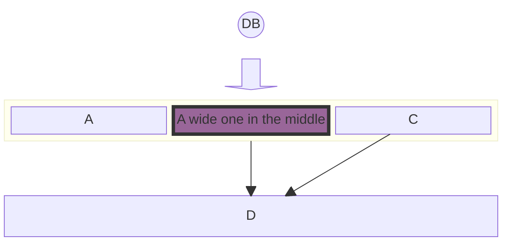


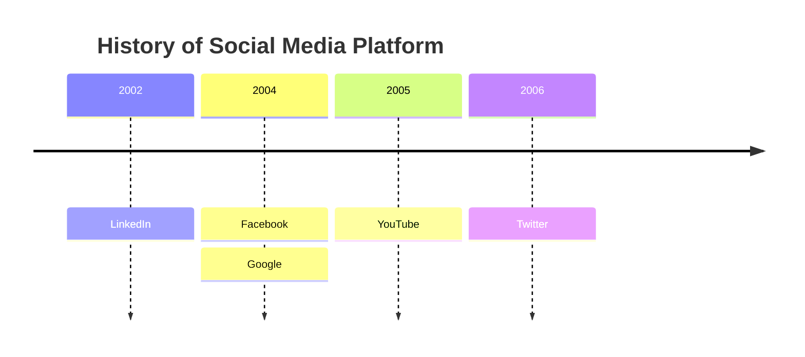

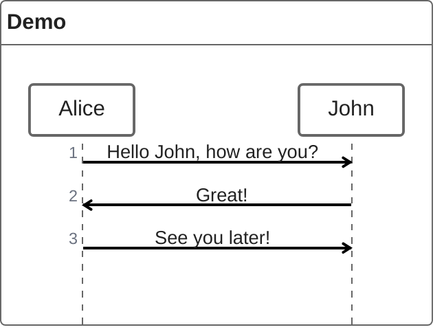


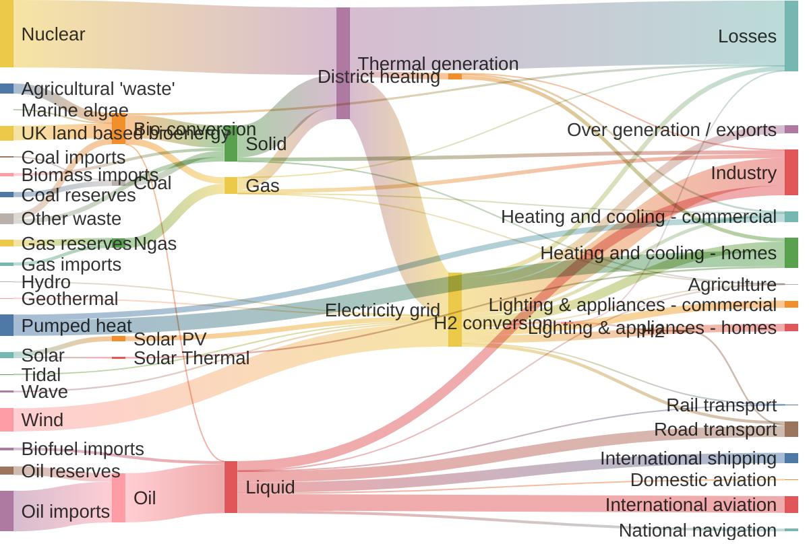


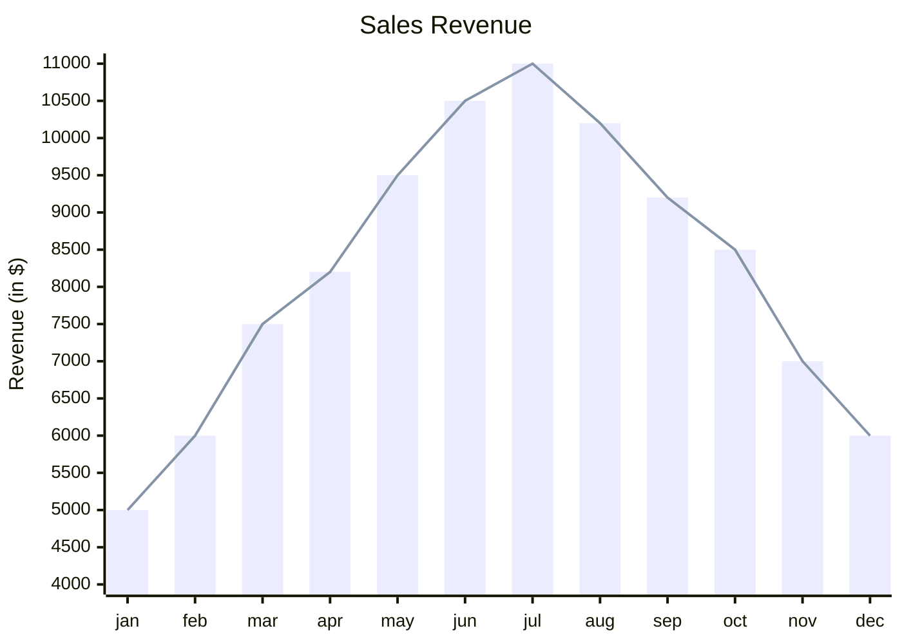


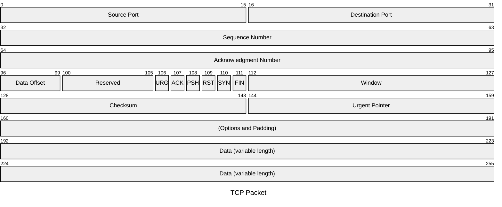


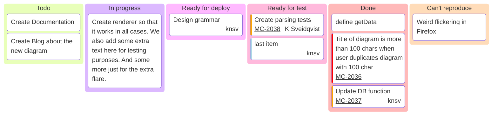


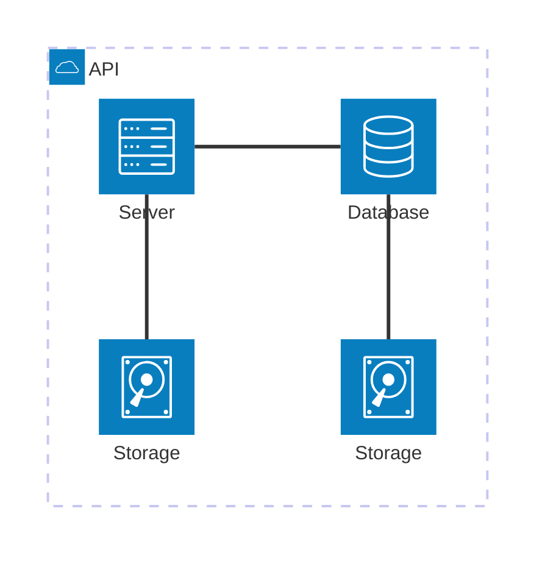


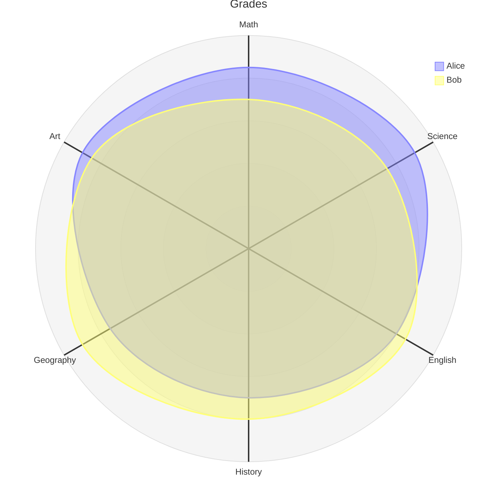


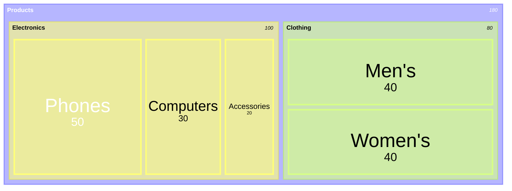


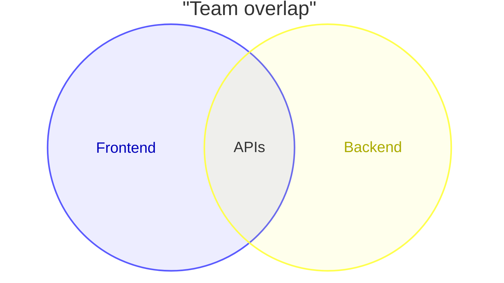


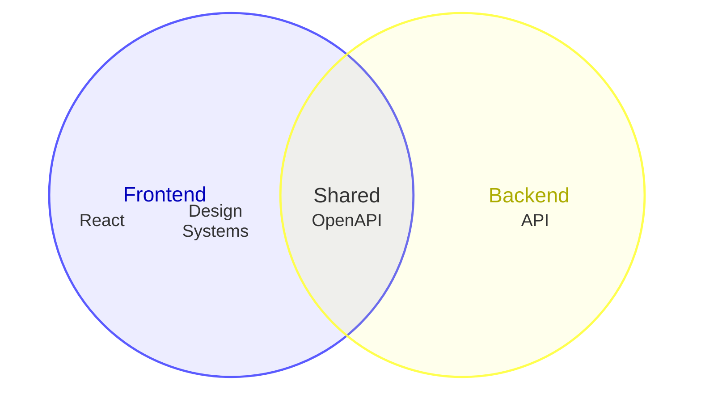


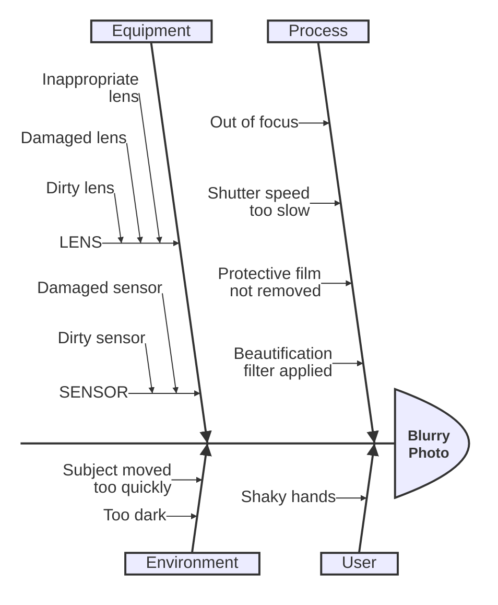


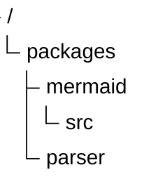


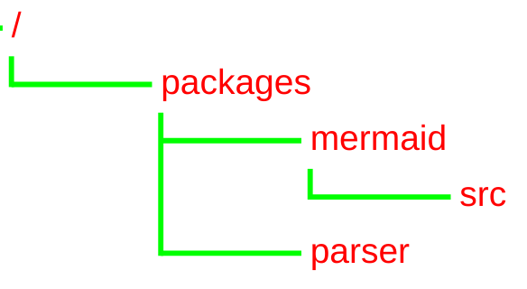


```mermaid
block-beta
  columns 4
  header: "Dashboard Financeiro (1440px)"
  
  side["Menu Lateral:<br/>• Home<br/>• Vendas<br/>• Usuários<br/>• Ajustes"]:1
  
  block:main:3
    columns 3
    nav["Barra de Busca / Notificações / Perfil"]:3
    
    card1["KPI: Vendas Totais<br/>R$ 45.000"]:1
    card2["KPI: Novos Leads<br/>120"]:1
    card3["KPI: Taxa de Conv.<br/>12%"]:1
    
    chart["Gráfico de Performance (Linha)"]:3
    table["Lista de Transações Recentes"]:3
  end
block-beta
  columns 4
  header: "Dashboard Financeiro (1440px)"
  
  side["Menu Lateral:<br/>• Home<br/>• Vendas<br/>• Usuários<br/>• Ajustes"]:1
  
  block:main:3
    columns 3
    nav["Barra de Busca / Notificações / Perfil"]:3
    
    card1["KPI: Vendas Totais<br/>R$ 45.000"]:1
    card2["KPI: Novos Leads<br/>120"]:1
    card3["KPI: Taxa de Conv.<br/>12%"]:1
    
    chart["Gráfico de Performance (Linha)"]:3
    table["Lista de Transações Recentes"]:3
  end
```


```mermaid
graph TD
    Header[Header: Logo | Links | CTA]
    Hero[Hero: Título de Impacto + Imagem + Botão]
    SocialProof[Logos: Empresas que confiam em nós]
    Features[Grid: 3 Colunas de Funcionalidades]
    Testimonials[Slider: Depoimentos de Clientes]
    Pricing[Cards: Planos Mensal / Anual]
    Footer[Footer: Sitemap | Redes Sociais]

    Header --> Hero --> SocialProof --> Features --> Testimonials --> Pricing --> Footer
```


```mermaid
kanban
  Todo
    [Visão do Produto]
    [Product Roadmap]
    [Item do Backlog A]
  Em Progresso
    [Item do Backlog B]
  Em Teste (QA)
    [Item do Backlog C]
  Concluído (Done)
    [Incremento do Produto]
    [Meta da Sprint batida]
```


```mermaid
kanban
  Todo
    Tarefa 1
    Tarefa 2
  In Progress
    Tarefa 3
  Done
    Tarefa 4
```


```mermaid
kanban
  A Fazer
    [Alta] Revisar contrato
    [Média] Atualizar documentação
  Em Execução
    [Urgente] Corrigir bug de login
  Concluído
    Configurar servidor
    Reunião de kickoff
```


```mermaid
kanban
  Backlog
    Task: Integrar API de Pagamento
    Task: Criar tela de perfil
  Em Desenvolvimento
    Task: Refatorar banco de dados
  Testando / QA
    Task: Validar responsividade
  Finalizado
    Task: Login com Google
    Task: Setup do projeto
```


Dica: Nem todos os editores de Markdown suportam nativamente o tipo kanban ainda (ele é recente no Mermaid). Se o seu editor não mostrar as colunas, você pode usar um Estado (State Diagram) ou um Fluxograma como alternativa.


```mermaid
flowchart TD
    subgraph Backlog
        b1[Planejar Sprint]
    end

    subgraph InProgress [Em Execução]
        p1[Desenvolver API]
        p2[Criar UI]
    end

    subgraph Review [Revisão]
        r1[Code Review]
    end

    %% Estilização
    style Backlog fill:#f9f,stroke:#333,stroke-width:2px
    style InProgress fill:#bbf,stroke:#333,stroke-width:2px
    style Review fill:#bfb,stroke:#333,stroke-width:2px
    style p1 fill:#ff9,color:#000 %% Destaque para um card específico
```


```mermaid
graph LR
    M1[Matéria Prima] -->|Entrada de Dados| P[Processamento/Montagem]
    P -->|Validação de Qualidade| M2[Produto Final]
    
    style P stroke-dasharray: 5 5
    Note over P: Metáfora: Nosso Motor de Cálculo <br/> funciona como uma prensa industrial.
```


```mermaid
quadrantChart
    title Registro de Partes Interessadas - Poder/Interesse
    x-axis Baixo Interesse --> Alto Interesse
    y-axis Baixo Poder --> Alto Poder
    quadrant-1 Monitorar (Baixo P/B I)
    quadrant-2 Manter Satisfeito (Alto P/B I)
    quadrant-3 Acompanhar (Baixo P/B I)
    quadrant-4 Gerenciar de Perto (Alto P/B I)
    "Equipe Interna": [0.3, 0.2]
    "Sponsor": [0.8, 0.9]
    "Cliente": [0.7, 0.8]
    "Fornecedor A": [0.2, 0.7]
    "Usuário Final": [0.1, 0.1]
```


```mermaid
board
    kanban
        A fazer
            [Definir Requisitos]
            [Estilo CSS]
        Em progresso
            [API Login]
        Feito
            [Configurar Servidor]
```


```mermaid
ishikawa
    title Causa Raiz - Atraso na Entrega
    Material: "Servidor lento"
    Material: "API Indisponível"
    Método: "Sem testes automatizados"
    Método: "Reuniões excessivas"
    Mão de Obra: "Falta de Devs"
    Mão de Obra: "Sickness"
    Máquina: "Notebooks antigos"
    Medida: "Estimativas erradas"
```


```mermaid
graph TD
    subgraph RACI
        direction TB
        M[Matriz de Responsabilidade]
        RACI_Table[

        | Tarefa | PM | Dev | QA |
        | :--- | :---: | :---: | :---: |
        | Escopo | A | C | I |
        | Codar | I | R | C |
        | Testar | I | C | R |
        ]
    end
```


```mermaid
kanban
  Todo
    Definir requisitos
    Criar banco de dados
  In Progress
    Desenvolver API
  Done
    Setup do servidor
```


```mermaid
quadrantChart
    title Matriz de Riscos (Impacto x Probabilidade)
    x-axis Baixa Probabilidade --> Alta Probabilidade
    y-axis Baixo Impacto --> Alto Impacto
    quadrant-1 Monitorar
    quadrant-2 Mitigar Urgente
    quadrant-3 Ignorar
    quadrant-4 Planejar Contingência
    Risco A: [0.3, 0.4]
    Risco B: [0.8, 0.9]
    Risco C: [0.7, 0.2]
```


O Mermaid é excelente porque o diagrama vira código. Se o escopo mudar, você altera uma linha de texto e o gráfico se ajusta sozinho, mantendo a documentação sempre "viva" e versionada.


```mermaid
gantt
    title Roadmap de User Stories - Sprint 1
    dateFormat  YYYY-MM-DD
    section Checkout
    Story: Autenticação Social    :active,  st1, 2023-10-01, 3d
    Story: Integração PayPal      :         st2, after st1, 5d
    section Perfil
    Story: Upload de Avatar       :         st3, 2023-10-02, 4d
```


Melhores Práticas
Mantenha Simples: Diagramas muito complexos são difíceis de entender
Use Cores com Propósito: Destaque elementos importantes
Seja Consistente: Use o mesmo estilo em toda documentação
Versione seus Diagramas: Guarde o código Mermaid, não apenas as imagens
Documente o Contexto: Adicione descrições ao redor dos diagramas


