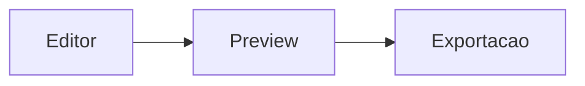

# Documento Modelo 3

## Guia rápido de snippets por tecnologia

Este documento demonstra como o editor pode armazenar exemplos curtos para linguagens diferentes.

---

## CSS

```css
.layout {
  display: grid;
  gap: 1rem;
  grid-template-columns: repeat(auto-fit, minmax(220px, 1fr));
}
```

## JavaScript

```javascript
async function carregarUsuarios() {
  const resposta = await fetch('/api/usuarios');
  return resposta.json();
}
```

## SQL

```sql
SELECT nome, email
FROM usuarios
WHERE ativo = true
ORDER BY nome;
```

## Mermaid


