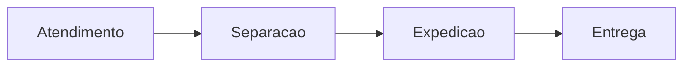

# Documento Modelo 3

## Kit de snippets do painel de pedidos

Exemplos curtos e coerentes com a mesma operacao: pedidos, status, atendimento e expedicao.

---

## CSS

```css
.card-status {
  padding: 1rem;
  border-radius: 1rem;
  background: #ffffff;
  border: 1px solid #e5e7eb;
}
```

## JavaScript

```javascript
const atrasados = pedidos.filter((pedido) => pedido.status === 'pendente');
console.log(`Pedidos atrasados: ${atrasados.length}`);
```

## SQL

```sql
SELECT numero, cliente_nome, status
FROM pedidos
WHERE status = 'pendente';
```

## Mermaid


