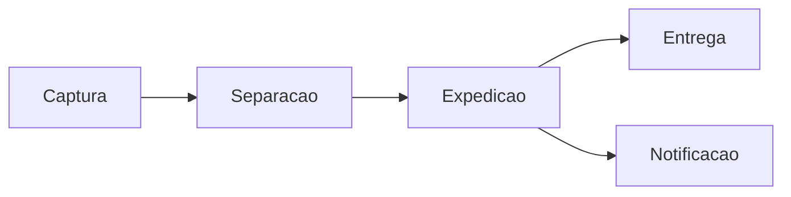

# Documento Modelo 3

## Kit de snippets do painel de pedidos

Exemplos curtos, mas mais proximos de um fluxo real: SLA, status, busca operacional e movimentacao do pedido.

---

## CSS

```css
.badge-status--pendente {
  background: rgba(255, 176, 32, 0.16);
  color: #8a5b00;
}
```

## JavaScript

```javascript
const pedidosCriticos = pedidos.filter((pedido) => pedido.slaMinutos <= 30);
console.log(`Pedidos criticos: ${pedidosCriticos.length}`);
```

## SQL

```sql
SELECT numero, cliente_nome, sla_minutos
FROM pedidos
WHERE status = 'pendente'
ORDER BY sla_minutos ASC;
```

## Mermaid


