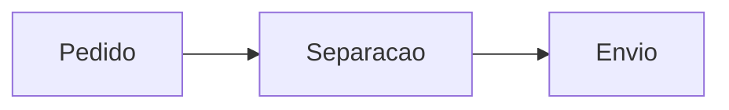

# Documento Modelo 3

## Nivel iniciante: leitura rapida dos snippets

Exemplos curtos para entender o basico de status, consulta e fluxo do pedido.

---

## CSS

```css
.badge-status--pendente {
  background: #fff4d6;
  color: #8a5b00;
}
```

## JavaScript

```javascript
const pedidosPendentes = pedidos.filter((pedido) => pedido.status === 'pendente');
console.log(`Pendentes: ${pedidosPendentes.length}`);
```

## SQL

```sql
SELECT numero, cliente_nome
FROM pedidos
WHERE status = 'pendente';
```

## Mermaid


