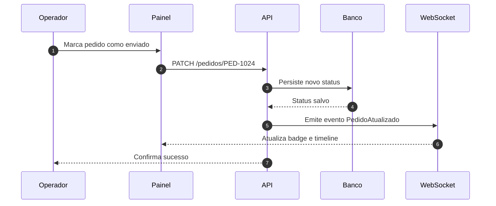

# Documento Modelo 4

## Pipeline do pedido ao envio

Documento enxuto para validar exportacao HTML, highlight de codigo e renderizacao Mermaid em um fluxo mais proximo de producao.

---

## Backend

```php
function atualizarStatus(PDO $pdo, string $numero, string $status): array
{
    $stmt = $pdo->prepare('UPDATE pedidos SET status = :status, atualizado_em = NOW() WHERE numero = :numero');
    $stmt->execute(['status' => $status, 'numero' => $numero]);

    return ['numero' => $numero, 'status' => $status];
}
```

## Frontend

```javascript
const aplicarAtualizacao = ({ numero, status }) => {
  const badge = document.querySelector(`[data-pedido="${numero}"] .badge-status`);
  if (badge) badge.textContent = status;
};
```

## Fluxo


