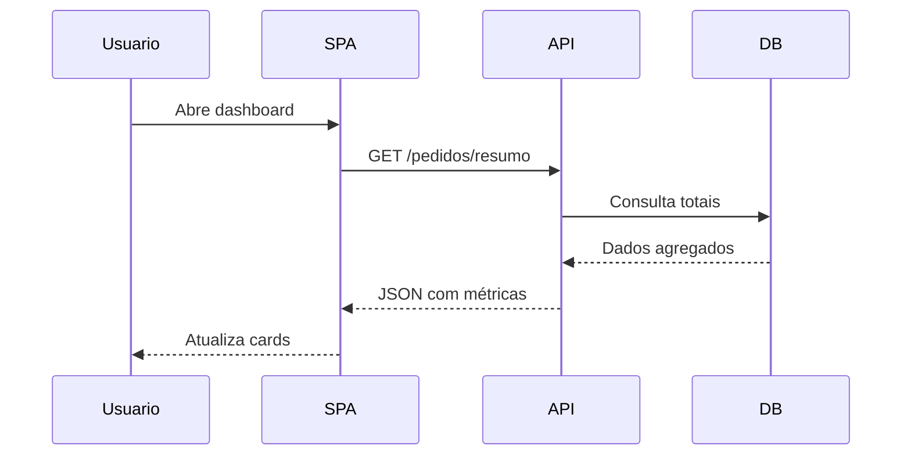

# Documento Modelo 4

## Pipeline de entrega com Mermaid e código

Exemplo enxuto para validar exportação HTML, highlight de código e renderização Mermaid na mesma página.

---

## Backend

```php
function buscarPedidos(PDO $pdo): array
{
    $stmt = $pdo->query('SELECT id, total FROM pedidos ORDER BY id DESC');
    return $stmt->fetchAll(PDO::FETCH_ASSOC);
}
```

## Frontend

```javascript
const atualizarResumo = (pedidos) => {
  const total = pedidos.reduce((soma, item) => soma + item.total, 0);
  document.querySelector('#total').textContent = total.toFixed(2);
};
```

## Fluxo


