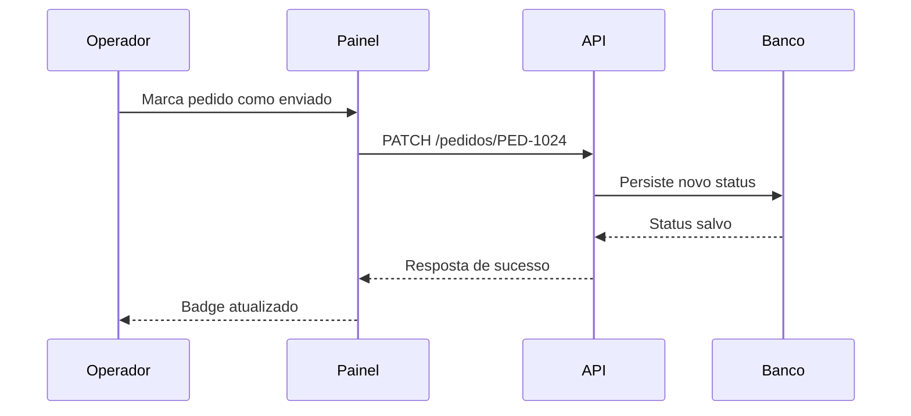

# Documento Modelo 4

## Pipeline do pedido ao envio

Documento enxuto para validar exportacao HTML, highlight de codigo e renderizacao Mermaid no mesmo fluxo de negocio.

---

## Backend

```php
function atualizarStatus(PDO $pdo, string $numero, string $status): void
{
    $stmt = $pdo->prepare('UPDATE pedidos SET status = :status WHERE numero = :numero');
    $stmt->execute(['status' => $status, 'numero' => $numero]);
}
```

## Frontend

```javascript
const atualizarBadge = (numero, status) => {
  document.querySelector(`[data-pedido="${numero}"]`).textContent = status;
};
```

## Fluxo


